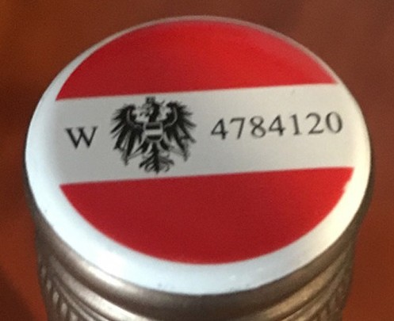
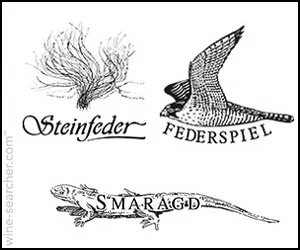
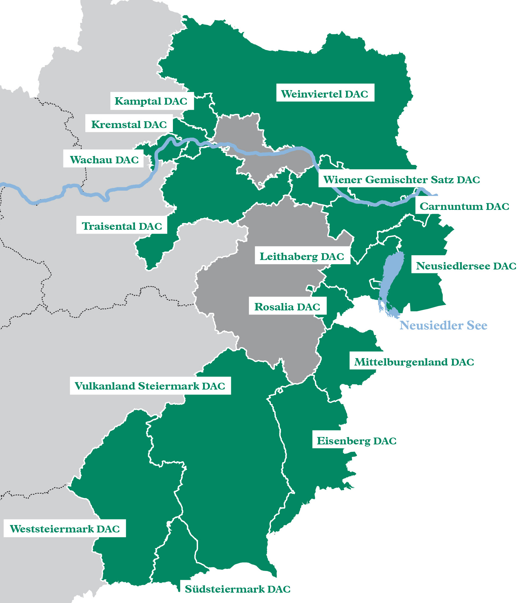
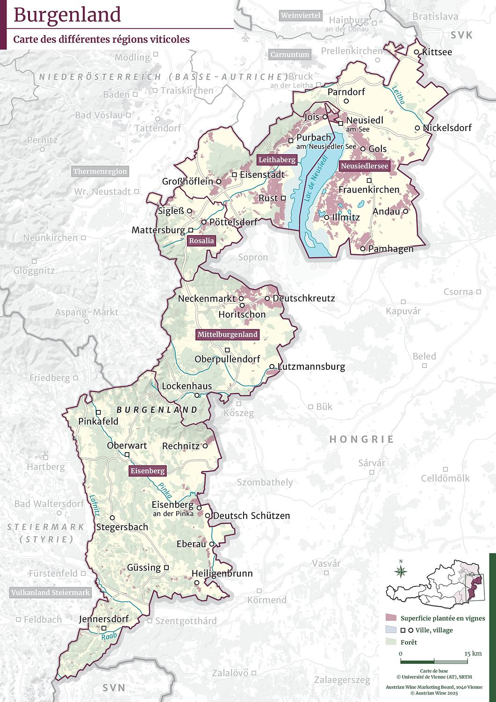
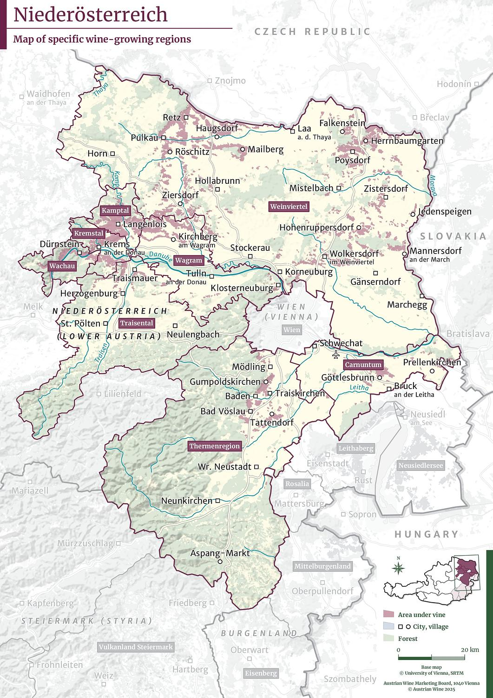
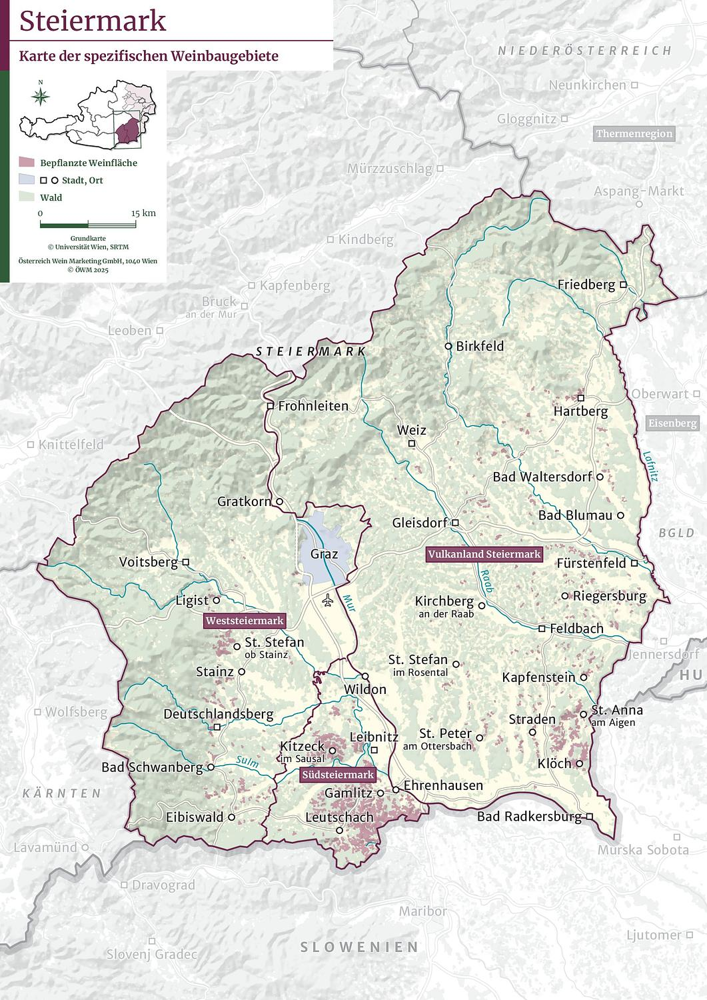

# Austria

## Maps

## Intro

### Climatic Influences (Pannonian Effect)

- severely continental climate
- Danube river warms nearby wine regions
- large diurnal shift:
  - Pannonian Plain brings warm winds during the day
  - cool winds from northern forests at night
- Styria: maritime influence provides longer, warmer days compared to other regions in Austria

### Austrian Quality Structure Qba & QmP

- QbA: Qualitätiswein Bestimmter Anbaugebiete:
  - base:
    - referred to as Qualitätswein
    - German quality classification
    - translates as: "quality wine from designated cultivation areas"
    - can use chaptalization
    - basic wine meant for everyday drinking
    - grapes must be picked and wine vinified in a single winegrowing region OR in the winegrowing region bordering it
    - produced from Qualitätswein grapes
    - minimum of 9% ABV
  - Kabinett:
    - riper fruit
    - no chaptalisation
    - maximum of 13% ABV
    - no sweetening
  - DAC:
    - wines that show a regional typicity.
- QmP: Qualitätiswein mit Prädikat:
  - old term for Prädikat.
  - fruit for the wine is inspected and certified
  - no chaptalisation
  - residual sugar is only from interruption of fermentation
  - categories:
    - Spätlese
    - Auslese
    - Beernauslese
    - Eiswein
    - Strohwein/Schilfwein
    - Trockenbeerenauslese

Sources:

- https://www.winespectator.com/glossary/show/id/qualit%C3%A4tswein_bestimmter_anbaugebiete_(qba)
- https://www.winespectator.com/glossary/show/id/pr%C3%A4dikatswein

### Define Ausbruch / Strohwein

- Strohwein:
  - sweet wine
  - made from grapes dried for at least 3 months
  - at least as sweet as Beerenauslese
  - botrytis is undesired.
- Ausbruch:
  - Trockenbeerenauslese made in Rust
  * name Ausbruch is a protected term for the wine from the city of Rust
  * Ruster Ausbruch DAC
  * similar production to Tokaji:
    - botrytis affected fruit from a vineyard is isolated and dried before combination with must from the other fruit from the same vineyard
    - the combined must is fermented
    - barrel aged
    * Traditionally Furmint

Sources:

- https://www.austrianwine.com/our-wine/wine-law/categories-of-wine-according-to-origin/wine-with-protected-designation-of-origin/

### DAC Quality Structure & Levels

- Qualitätswein that meets additional regionally specific requirements can take on a DAC name
- There are three levels of narrowing geographical specificity:
  - Gebietswein: regional wine
  - Ortswein: village wine
  - Riedenwein: single vineyard wine

### Wachau Quality Terms

1. Steinfeder: max 11.5% abv, min 15° KMW
2. Federspiel: 11.5 - 12.5% abv, min 17° KMW
3. Smaragd: min 12.5% abv, min 18.2° KMW

### Principal Grape Varietals & Production Districts where Best Grown

- white:
  - Grüner Veltliner:
    - Burgenland (Eiswein)
    - Weinviertel DAC
    - Wachau DAC
  - Riesling:
    - Lower Austria
    - Weinviertel
    - Niederösterreich
    - Wachau
  - Welschriesling:
    - Weinviertel (Sekt)
    - Burgenland (TBA)
    - Styria (casual dry white)
  - Chardonnay (Morillon):
    - Steiermark
  - Weissburgunder (Pinot Blanc):
    - everywhere
  - Sauvignon Blanc:
    - Styria
- red:
  - Blaüfrankisch:
    - north, central, and southern Burgenland
    - Eastern Niederösterreich
  - Zweigelt:
    - Niederösterreich
    - Burgenland
  - St. Laurent:
    - Thermenregion ()
    - northern Burgenland
  - Blauer Portugieser:
    - Niederösterreich
  - Blauburger:
    - Weinviertel

Sources:

- https://www.austrianwine.com/our-wine/grape-varieties/
- https://www.guildsomm.com/research/expert_guides/w/expert-guides/2449/austria#05

### Labelling Terms

- banderole:
  - red and white label on the capsule that indicates that the wine has passed Austria's stringent quality control.
- DAC:
  - Districtus Austriae Controllatus:
    - region based appellation system
    - _Klassik_: DAC _Klassik_ for lighter fruit driven wines
    - _Reserve_: DAC _Reserve_ for fuller wines with possible oak or botrytis
  - implies that the wine presents regional typicity
  - follows certain defined restrictions to enforce typicity
- sweetness level
- erzeugerabfüllung: bottled at property
- Quality control number
- quality tier (choose one):
  - Landwein: equivalent to Vin de Pays, a IGP wine
  - Qualitätswein: level above Landwein, a regional wine made from one of the recognised winegrowing regions and from a restricted set of varieties
  - Prädikatswein: indicates that the fruit is premium, measured on must weight. Divided into 5 levels, or _Prädikats_.
- Wachau System, created by _Vinea Wachau_, a winegrower alliance:
  - 3 levels:
    - steinfeder:
      - fresh, fruity, tangy
      - named for a grass that grows in Wachau's stony terraces
    - federspiel:
      - fuller level: 11.5% - 12.5% alcohol
      - named for falconry
    - Smaragd:
      - richest
      - minimum 12% alcohol
      - translates literally to emerald but refers to emerald-green lizard who sunbaths on the stone terraces of Wachau
  - Typically riesling, GV or rosé made from Zweigelt.
- Abfüller: bottler or shipper
- Gutsabfüllung: producer bottled wine
- halbtroken: medium dry
- rotwein: red wine
- troken: dry
- Weingut: wine estate
- Weisswein: white wine
- Winzergenossenschaft: cooperative

Sources:

- https://www.wine-searcher.com/wine-label-austria

## Certified

### DAC Districts and Location

- DAC:
  - Burgenland:
    - Eisenberg DAC
    - Leithaberg DAC
    - Neusiedlersee DAC
    - Rosalia DAC
    - Mittelburgenland DAC
    - Ruster Ausbruch DAC
  * Wein:
    - Wiener Gemischter Satz DAC:
      - field blend from vineyards in Vienna (Wein)
  * Steiermark (Steirland):
    - Südsteiermark DAC
    - Vulkanland Steiermark DAC
    - Weststeiermark DAC
  * Niederösterreich:
    - Wachau DAC
    - Kremstal DAC
    - Kamptal DAC
    - Traisental DAC
    - Wagram DAC
    - Weinviertel DAC
    - Carnuntum DAC
    - Termenregion DAC

#### Maps

DAC MAP

 Burgenland DACs
  

Niederösterreich DACs

Steiermark DACs

### Wines Produced

- dry white.
- off-dry whites.
- dessert wines: typically botrytise affected.
- dry reds.
- dry sparkling whites.

### Wine Terms

- Traubenmost: grape must from grapes harvested and pressed in Austria
- Sturm: partially fermented grape must
- Perlwein:
  - sparkling Wine
  - min 9% ABV
  - 3 ATM
  - any winemaking method
- Reserve:
  - minimum 13% abv for Qualitatswein
- Trocken:
  - dry
  - max 9 g/L
- Halbtrocken:
  - off-dry
  - max 18 g/L
- Lieblich:
  - med-sweet
  - max. 45 g/L
- Sweet:
  - min. 45 g/l
