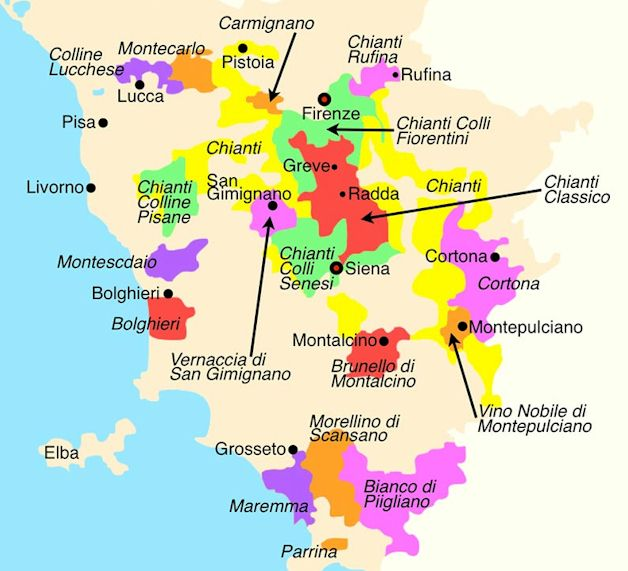

# italy

<!-- vim-markdown-toc GFM -->

- [Intro](#intro)
  - [01 Climatic Influences](#01-climatic-influences)
  - [02 Quality Structure IGT, DOC, DOCG](#02-quality-structure-igt-doc-docg)
  - [03 Wine Producing Districts and Location](#03-wine-producing-districts-and-location)
  - [04 Principal Grape Varietals and Regions](#04-principal-grape-varietals-and-regions)
  - [05 Principal Wines of Each Region and Varietals Used in Production](#05-principal-wines-of-each-region-and-varietals-used-in-production)
  - [06 Production Methods](#06-production-methods)
    - [Recioto](#recioto)
    - [Ripasso](#ripasso)
    - [Amarone](#amarone)
    - [Vin Santo](#vin-santo)
  - [07 Labelling Terms](#07-labelling-terms)
  - [08 Prosecco Quality levels and Production Methods](#08-prosecco-quality-levels-and-production-methods)
- [Cert](#cert)
  - [01 DOCG's in Each Region](#01-docgs-in-each-region)
  - [02 Aging Requirements and Specified Terms](#02-aging-requirements-and-specified-terms)
    - [Barolo](#barolo)
    - [Barbaresco](#barbaresco)
    - [Chianti](#chianti)
    - [Vino Nobile](#vino-nobile)
    - [Brunello di Montalcino](#brunello-di-montalcino)
  - [03 Sub-Districts of Chianti](#03-sub-districts-of-chianti)

<!-- vim-markdown-toc -->

## Intro

### 01 Climatic Influences

- North:
  - moderate continental climate
  - Alps: rainshadow
  - moderating bodies of water: Po River, Lake Garda
- South:
  - hot and dry inland
  - humid on the coast - Mediterranean climate
  - altitude used to moderate heat
  - Apennines mountains used for altitude

### 02 Quality Structure IGT, DOC, DOCG

- IGT (Indicazione Geografica Tipica):
  - equivalent to PGI
  - introduced in 1992 as "Goria's Law"
- DOC (Denominazione di Origine Controllata):
  - introduced in 1963
  - formalize and protect wine appellations
  - similar to french AOC/AOP
- DOCG:
  - top
  - considered equivalent to PDO
  - first awarded in 1980
  - typically require minimum aging

### 03 Wine Producing Districts and Location

- North:
  - Piedmont
  - Valle d'Aosta
  - Lombardy
  - Liguria
  - Emilia-Romagna
  - Trentino-Alto Adige
  - Veneto
  - Fruili-Venezia Giulia
- Central:
  - Tuscany
  - Umbria
  - Marches
  - Abuzzo
  - Lazio
  - Molise
- South:
  - Campania
  - Apulia
  - Basilicata
  - Calabria
  - Sicilia
  - Sardinia

### 04 Principal Grape Varietals and Regions

- white:
  - North:
    - Pinot Grigio:
      - Trentino Alto-Adige
      - Fruili-Venezia Giulia
      - Veneto
    - Moscato Bianco (Muscat à Petits Grains): Asti
    - Garganega: Soave
    - Cortese:
      - Gavi
  - Central:
    - Grechetto: Umbria
    - Trebbiano: Umbria, Lazio
    - Malvasia: Lazio
    - Verdicchio: Marche
  - South:
    - Fiano: Campania
    - Greco: Campania
    - Carricante: Sicily
    - Cataratto: Sicily
- red:
  - North:
    - Corvina: Valpolicella
    - Nebbiolo:
      - Barolo
      - Barbaresco
    - Barbera:
      - Asti
    - Dolcetto
      - Alba
  - Central:
    - Sangiovese:
      - Chianti
      - Brunello
    - Montepulciano:
      - Abruzzo
  - South:
    - Aglianico: Campania, Basilicata
    - Negroamaro: Apulia
    - Primitivo: Apulia
    - Nero d'Avola: Sicily
    - Nerello Mascalese: Sicily

### 05 Principal Wines of Each Region and Varietals Used in Production

TODO:

- North:
  - Piedmont:
    - Red:
      - Nebbiolo
      - Dolcetto
      - Barbera
    - white:
      - Gavi: Cortese
    - sweet:
    - Moscato d'Asti: Moscato Bianco
    - Brachetto
  - Lombardy:
    - Franciacorta: sparkling wine from Chardonnay, Pinot Noir, Pinot Bianco
    - Pinot Noir
    - Vatellina: Nebbiolo (Chiavennasca)
    - Sforzato: Nebbiolo made with dried grapes
    - Moscato di Scanzo: Red Moscato
    - Oltrepò Pavese metodo Classico DOCG: min. 70% Pinot Nero
  - Liguria:
    - Colli di Luni: Pigato
    - Riviera Ligure di Ponente Blanc: Pigato
    - Riviera Ligure di Ponente Rosso: Rossese
  - Emilia-Romagna:
    - Romagna Albana: Albana
    - Colli Bolognesi Pignoletto: Grechetto
    - Lambrusco: Lambrusco
  - Trentino-Alto Adige:
    - white:
      - Gewürztraminer
    - red:
      - Schiava
      - Lagrein
      - Pinot Noir
      - Teroldego
  - Veneto:
    - sparkling:
      - Prosecco: 85% Glera
    - white:
      - Pinot-Grigio
      - Soave DOC:
        - 70% Garganega + 30% Trebbiano di Soave and/or Chardonnay
    - red:
      - Valpolicella DOC: 45-95% Corvina + Rondinella
        - subcategories:
          - Amarone della Valpolicella
          - Recioto della Valpolicella
      - Bardolino DOC: Corvina + Rondinella
  - Fruili-Venezia Giulia:
    - white:
      - Pinot Bianco
      - Pinot Grigio
      - Sauvignon (Sauvignon Blanc)
      - Riabolla Gialla
      - Friulano
    - sweet:
      - Verduzzo Gialla (ramandolo)
    - red:
      - Cabernet
      - Merlot
    - orange wine
- Central:
  - Tuscany:
    - red:
      - Chianti DOCG: Sangiovese blend
      - Chianti Classico DOCG: Sangiovese blend
      - Carmignano DOCG: Sangiovese blend
      - Vino Nobile de Montepulciano DOCG: Sangiovese blend
      - Mrellino di Scansano DOCG: Sangiovese blend
      - Montecucco Sangiovese DOCG: Sangiovese blend
      - Brunello di Montalcino DOCG: 100% Sangiovese
      - Super-Tuscans: Sangiovese + Cabernet Sauvignon and/or Merlot
    - white:
      - Trebbiano
      - Malvasia
  - Umbria
  - Marches
  - Abuzzo
  - Lazio
  - Molise
- South:
  - Campania
  - Apulia
  - Basilicata
  - Calabria
  - Sicilia
  - Sardinia

### 06 Production Methods

#### Recioto

- appassimento method:
- grapes are dried before fermentation
- 3 months
- dried in special lofts called _fruttai_
- concentrates sugar and extract
- Recioto wines (Recioto della Valpolicella) dried for an additional month
- fermentation is stopped before completion
- wine is semi-sweet or sweet

#### Ripasso

- lit. "re-passed"
- a secondary fermentation of a wine
- use unpressed skins of grapes used for Amarone or Recioto wine

#### Amarone

- appassimento method
- fermented to dry or near dryness
- traditionally aged in _botti_
- contemporary winemakers may use barrique.

#### Vin Santo

- Trebbiano and Malvasia
- grapes are dried by hanging from rafters
- usually dried for ~9 months (1st December following harvest)
- fermentation is slow
- fermentation and maturation in _caratelli_ barrels
- traditionally chestnut used for rapid oxidation
- oak becoming more prevalent

### 07 Labelling Terms

- Tenuta: estate
- Azienda: Company
- Castello: Castle
- Cascina: farmhouse
- Imbottigliato all'origine/dal produttore: estate-bottled
- Vigna/Vigneto: indication of single vineyard origin
- Liquoroso: fortified wine

Sources:

- <https://www.cellartours.com/blog/italy/decoding-italian-wine-labels-a-guide-for-curious-drinkers>

### 08 Prosecco Quality levels and Production Methods

- production:
- Charmat method:
  - also known as tank method
  - process:
    - make a still base wine
    - put it in a pressurised tank
    - add yeast and sugar to begin 2nd ferment
    - wait 1 - 6 weeks
    - chill to 0°C to stop ferment
    - dosage mix of wine and sugar to achieve desired sweetness level
    - filter and bottle
- secondary ferment in large steel autoclaves
- styles:
- Frizzante:
  - slightly sparkling
- Spumante superiore:
  - fully sparkling
  - sweetness:
    - brut
    - demi-sec:
      - secondary ferment in bottle
- quality levels (in ascending order):
  1. prosecco DOC
  2. Prosecco DOC Treviso/Trieste
  3. Asolo DOCG/Conegliano Valdobbiadene DOCG
  4. Superiore di Cartizze Rive DOCG
- non-vintage
- 85% of the wine is Glera

Sources:

- <https://wineacademy.com.au/the-charmat-method/>
- <https://www.guildsomm.com/research/compendium/w/italy/1338/prosecco-doc>
- <https://i1.wp.com/socialvignerons.com/wp-content/uploads/2017/10/Infografic-guide-Prosecco-quality-level-doc-docg-conegliano-valdobbiadene-treviso-veneto-asolo.jpg?resize=818%2C519>

## Cert

### 01 DOCG's in Each Region

- North:
  - Piedmont:
    - Barolo DOCG
    - Barbaresco DOCG
    - Langhe DOCG
    - Barolo Chinato DOCG
    - Roero DOCG
    - Ghemme DOCG
    - Gattinara DOCG
    - Monferrato:
      - Barbera d'Asti DOCG
      - Berbera del Monferrato Superiore DOCG
      - Ruchè di Castagnole Monferrato DOCG
      - Nizza DOCG
    - Dogliani DOCG
    - Dolcetto di Ovada Superiore DOCG
    - Dolcetto di Diano d'Alba DOCG
    - Gavi DOCG
    - Erbaluce di Caluso DOCG
    - Asti DOCG
    - Canelli DOCG
    - Alta Langa DOCG
    - Brachetto d'Acqui DOCG
  - Lombardy:
    - Franciacorta DOCG
    - Oltrepò Pavese Metodo Classico DOCG
    - Valtellina Superiore DOCG
    - Sforzato di Valtellina DOCG
    - Moscato di Scanzo DOCG
  - Emilia-Romagna:
    - Romagna Albana DOCG
    - Colli Bolognesi Pignoletto DOCG
  - Veneto:
    - Valpolliella:
      - Recioto della Valpollicella DOCG
      - Amarone della Valpolicella DOCG
    - Bardolino Superiore DOCG
    - Soave:
      - Recioto di Soave DOCG
      - Soave Superiore DOCG
    - Recioto di Gambellara DOCG
    - Prosecco:
      - Valdobbiadene Prosecco DOCG
      - Asolo Prosecco DOCG
    - Colli Euganei Fior d'Arancio DOCG
    - Plave Malanotte DOCG
    - Lison DOCG
  - Fruili-Venezia Giulia:
    - Ramandolo DOCG
    - Colli Orientali del Friuli-Picolit DOCG
    - Rosazzo DOCG
    - Lison DOCG
- Central:
  - Tuscany:
    - Chianti DOCG
    - Chianti Classico DOCG
    - Carmignano DOCG
    - Vino Nobile di Montepulciano DOCG
    - Morellino di Scansano DOCG
    - Montecucco Sangiovese DOCG
    - Brunello di Montalcino DOCG
    - Rosso della Val di Cornia DOCG
    - Suvereto DOCG
    - Elba Aleatico Passito DOCG
    - Vernaccia di San Gimignano DOCG
  - Umbria:
    - Sagrantino di Montefalco DOCG
    - Torgiano Rosso Riserva DOCG
  - Marches:
    - Verdicchio di Matelica Riserva DOCG
    - Castelli di jesi Verdicchio Riserva DOCG
    - Conero Rosso Riserva DOCG
    - Vernaccia di Serrapetrona DOCG
    - Offida DOCG
  - Abuzzo:
    - Colline Teramane Montepulciano d'Abruzzo DOCG
  - Lazio:
    - Frascati Superiore DOCG
    - Cannellino di Fascati DOCG
    - Cesanese del Piglio DOCG
- South:
  - Campania:
    - Taurasi DOCG
    - Aglianico del Taburno DOCG
    - Greco di Tufo DOCG
    - Fiano di Avellino DOCG
  - Apulia:
    - Castel del Monte Rosso Riserva DOCG
    - Castel del Monte Nero di Troia Rieserva DOCG
    - Castel del Monte Bombino Nero DOCG
    - Primitivo di Manduria Dolce Naturale DOCG
  - Basilicata:
    - Aglianico del Vulture Superiore DOCG
  - Sicilia:
    - Cerasuolo di Vittoria DOCG
  - Sardinia:
    - Vermentino di Gallura DOCG

### 02 Aging Requirements and Specified Terms

#### Barolo

- base:
  - min. 38 months from November 1 of harvest year
  - min. 18 months in wood
- Riserva: 62 months

#### Barbaresco

- base:
  - min. 26 months from November 1 of harvest year
  - must include 9 months in cask
- Riserva: min. 50 months.

#### Chianti

- Chianti DOCG:
  - Chianti Normale: released 1 March year follwoing harvest
  - Riserva: 2 years of aging
  - Superiore: Riserva with +0.5 alcohol and lower vineyard yields
- Chianti Classico DOCG:
  - base: Release October 1st year following harvest
  - Riserva:
    - min. 24 months
    - 3 months in bottle
    - min. alcohol 12.5%
  - Gran Selezione:
    - min. 30 months
    - 3 months in bottle
    - min. 13% ABV
    - min. 90% Sangiovese

#### Vino Nobile

- base:
  - min. 2 years
  - min. 1 year in wood
- Riserva:
  - min. 3 years
  - include min. 6 months in bottle

#### Brunello di Montalcino

- base:
  - min. 2 years in cask
  - min. 4 months in bottle
  - canot be releasd until January 1st of the 5th year following harvest
- Riserva:
  - min. 2 years in cask
  - min. 6 months in bottle
  - cannot be released until 6 years following harvest

### 03 Sub-Districts of Chianti

- Classico
- Rùfina
- Colli Fiorentini
- Colli Senesi
- Colline Pisane
- Colli Aretini
- Mntalbano
- Montespertoli

