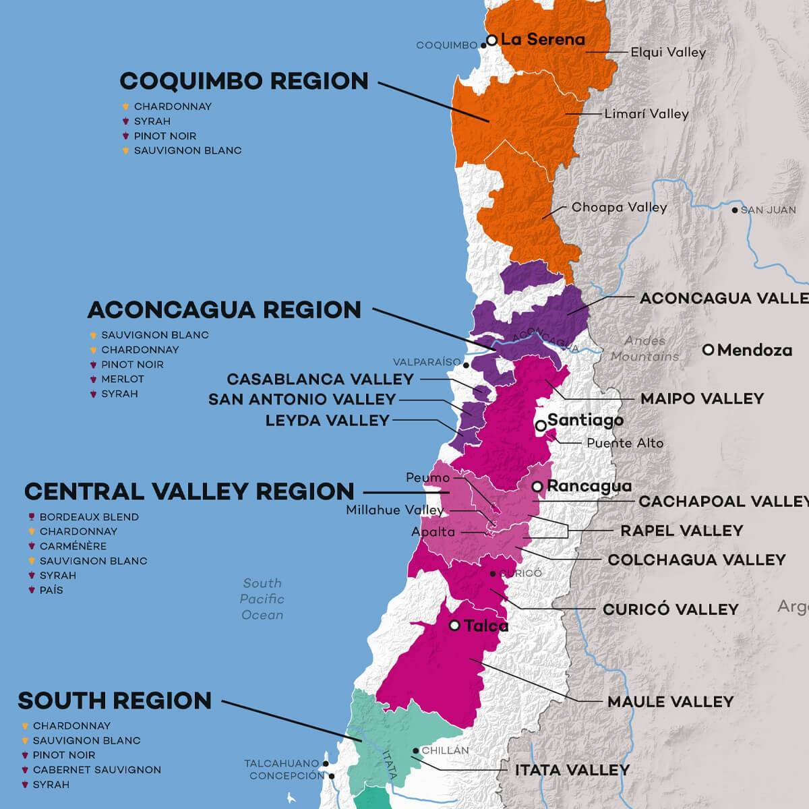
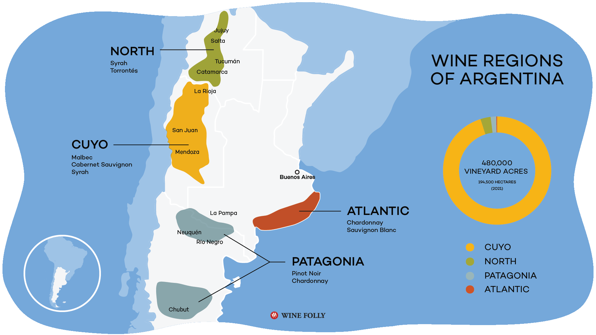
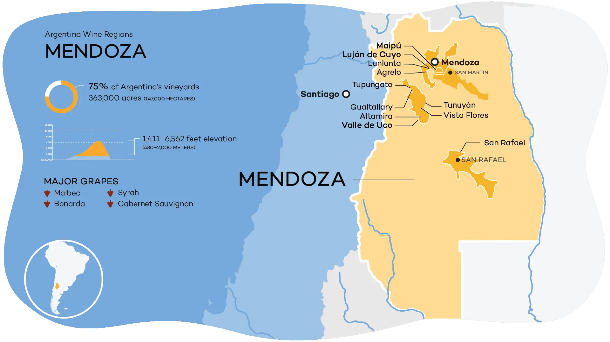

# South America

## Intro

### 01 Climatic Influences

#### Chile

- General:
  - generally warm mediterranean climate
  - El Niño (rain)/La Niña (drought)
  - dry sunny growing season
- Pacific Ocean:
  - Pacific Ocean to the west
  - Pacific Ocean moderates climate
  - Humboldt Current:
    - cold Humboldt Current provides cooling influence
    - runs from Antarctica along Chilean coast
    - Cold, blows cool air inland along river valleys during the day
    - strongest effect where coastal mountain ranges are lowest
- Topography:
  - coastal mountain ranges in the east
  - Andes to the west
  - Andes provides cool nighttime temperatures
  - Central Valley formed between coastal mountain ranges and Andes
  - cooling from cold air descending from mountains at night (large diurnal shift)
- Latitude:
  - climate varies hugely as travel North to south
  - North is dry and desert-like
  - cooler and wetter in the south, shorter growing season
  - Rainfall higher in the south
- Altitude:
  - variation in altitude affects climate of growing

Sources:

- [Guildsomm - South America](https://www.guildsomm.com/learn/study/w/study-wiki/206/south-america)
- WSET _Understanding wines: Explaining Style and Quality_ (2016), _Chile_

#### Argentina

[Guildsomm - South America](https://www.guildsomm.com/learn/study/w/study-wiki/206/south-america):

- General:
  - vines in the west
  - continental climate
  - extremely hot summers
  - intense sunshine
  - hot ground (need pergolas)
  - dry
- Hazards:
  - spring frost
  - summer hail
  - Zonda:
    - strong dry wind
    - blows from mountains
    - occurs in spring and early summer
    - dries local environment
    - can affect flowering
- Topography:
  - Andes rain shadow: very dry
- Elevation:
  - high elevation
  - average vineyard elevation: 900m
  - altitude moderates extreme summer temperatures

Sources:

- [Guildsomm - South America](https://www.guildsomm.com/learn/study/w/study-wiki/206/south-america)
- WSET _Understanding wines: Explaining Style and Quality_ (2016), _Argentina_

### 02 Climate of South America and Topographical Influences (Andes - Pacific)

See [01 Climatic Influences](#01-climatic-influences).

### 03 Chile Wine Laws

[Guildsomm - Chile](https://www.guildsomm.com/research/expert_guides/w/expert-guides/2445/chile#04):

- Denominación de Origen (DO)
- established 1995
- hierarchy of GI with each tier becoming more specific
- 4 tiers:
  - region: Región Vitícola
  - subregion
  - zone
  - area
- similar to South African Wine of Origin system
- restrictions are the same at every level of the hierarchy
- require 75% grapes harvested in stated location
- requires 75% of varietal labeled
- requires 75% of vintage labelled
- sweetness levels are defined: seco, semi seco, semi dulce, dulce
- quality levels: reserva and up:
  - Superior -> Gran Reserva
- 2012 update:
  - new divisions to DO based on proximity to coast
  - categories:
    - coast: _Costa_
    - between the mountains: _Entre Cordilleras_
    - Andes
  - intended to indicate style based on latitude-oriented climate differences

### 04 Key Districts: Casablanca, Maipo & Rapel

#### Map of Chile Wine Regions

Map of Chile Wine Regions

#### Casablanca

- DO: Valle de Casablanca DO
- Región Vitícola: Aconcagua
- Major town: Casablanca
- DO Areas: Costa
- Major Grapes:
  - Ch.
  - SB
  - PN
  - Mer.
  - Syr.

sources:

- [Compendium](https://www.guildsomm.com/research/compendium/w/chile1/1883/valle-de-casablanca-do)

#### Maipo

- DO: Valle del Maipo DO
- Región Vitícola: Valle Central
- Major town: Santiago
- DO Areas:
  - Entre Cordilleras
  - Andes
- Major grapes:
  - CS
  - Mer
  - Syr
  - Ch

Sources:

- [Compendium](https://www.guildsomm.com/research/compendium/w/chile1/1893/valle-del-maipo-do)

#### Rapel

- DO: Valle del Rapel DO
- Región Vitícola: Valle Central
- major town: Rancagua
- zones:
  - Valle del Chachapoal DO
  - Valle de Colchagua DO
- DO Areas:
  - Costa
  - Entre Cordilleras
  - Andes
- Major grapes:
  - CS
  - Carm.
  - Mer.
  - Syr.
  - Ch.

Sources:

- [Compendium](https://www.guildsomm.com/research/compendium/w/chile1/1896/valle-del-rapel-do)

#### Map of Argentina Wine Regions

Map of Argentine Wine Regions

### 05 Principle Varietals of Chile and Argentina

#### Chile

red:

- Cabernet Sauvignon
- Merlot
- Carmenére
- Syrah

white:

- Sauvignon Blanc
- Chardonnay

#### Argentina

red:

- Malbec
- Bonarda
- Cabernet Sauvignon

white:

- Torrontés
- Chardonnay

Sources:

- WSET, _Understanding Wines: Explaining Style and Quality_ 2016, _Chile_
- WSET, _Understanding Wines: Explaining Style and Quality_ 2016, _Argentina_

### 06 Regions and Varietals Grown

#### Chile

Regiones Vitivinícolas:

- Atacama DO:
  - Pisco grapes
- Coquimbo DO:
  - White:
    - Pedro Jiminez
    - SB
    - Ch
  - Red:
    - Syrah
    - CS
- Aconcagua DO:
  - white:
    - SB
    - CH
  - red:
    - CS
    - Syr.
    - Carm.
    - PN
    - Merl.
- Valle Central DO:
  - white:
    - CH
    - SB
  - red:
    - CS
    - Mer.
    - Syr.
    - Carm.
    - País
- Sur DO:
  - white:
    - Moscatel de Alejandría
    - Ch.
    - SB
  - red:
    - Cinsault
    - CS
    - PN
    - País
- Austral DO:
  - red:
    - CS
    - Carm.
    - Mer.
    - País

Sources:

- [Compendium - Chile](https://www.guildsomm.com/research/compendium/w/chile1)
- [Wikipedia (Austral DO)](<https://en.wikipedia.org/wiki/Austral_(wine_region)>)

#### Argentina

Regions:

- ## Atlantic:
- ## Center:
- Cuyo IG:
  - white:
    - Pedro Gimémenz
    - Moscatel de Alejandría
    - Torrontés Sanjuanino
    - Torrontés Riojano
    - CH
    - CB
  - red:
    - Malbec
    - Syrah
    - Bonarda
    - CS
    - Tempranillo
    - Cereza
- North:
  - white:
    - Torrontés Riojano
    - SB
  - red:
    - CS
    - Mal.
    - Syr.
    - Bonarda
    - Cereza
    - Tannat
- Patagonia IG:
  - White:
    - CH
    - Palomino
    - SB
    - Torrontés Mendocino
    - Torrontés Riojano
    - Pedro Giménez
    - CH
  - Red:
    - Merlot
    - Malbec
    - CS
    - CF
    - Pinot Negro
    - Syrah

Sources:

- [Compendium](https://www.guildsomm.com/research/compendium/w/argentina)

## Cert

### 01 Sub Districts of Chilean Wine Regions

1. Atacama DO:
   a. Valle de Copiapó DO
   b. Valle del Huasco DO
2. Coquimbo DO:
   a. Valle del Elqui DO
   b. Valle del Limarí DO
   c. Valle del Choapa DO
3. Aconcagua DO:
   a. Valle del Aconcagua DO
   b. Valle de Casablanca DO
   c. Valle de San Antonio DO
4. Central Valley DO:
   a. Valle del Maipo DO
   b. Valle del Rapel DO
   c. Valle de Curicó DO
   d. Valle del Maule DO
5. South DO:
   a. Valle del Itata DO
   b. Valle del Bío-Bío DO
   c. Valle del Malleco DO
6. Austral DO:
   a. Valle del Cautín DO
   b. Valle de Osorno DO

Sources:

- [Compendium - Chile](https://www.guildsomm.com/research/compendium/w/chile1)

### 02 Sub districts of Mendoza

- Primera Zona:
  - Luján de Cuyo DOC:
    - Agrelo IG
    - Las Compuertas IG
    - Vistalba IG
  - Maipú IG:
    - Las Barrancas IG
    - Lunlunta IG
    - El Paraíso IG
    - Russell IG
  - Godoy Cruz IG
- North Mendoza:
  - Guaymallén IG
  - Las Heras IG
  - Lavalle-Desierto de Lavalle IG
- South Mendoza:
  - San Rafael DOC
  - General Alvear IG
- East Mendoza:
  - Rivadavia IG
  - Junín IG
  - San Martin IG
  - Santa Rosa IG
  - La Paz IG
- Uco Valley IG:
  - Tupungato IG:
    - El Paral IG
  - Tunuyán IG:
    - San Pablo IG
    - Los Chacayes IG
    - Vista Flores IG
  - San Carlos IG:
    - La Consulta IG
    - Paraje Altamira IG
    - El Cepillo IG

Sources:

- [Compendium - Mendoza IG](https://www.guildsomm.com/research/compendium/w/argentina/1228/mendoza-ig)

### 03 Argentinian Native Varietals

The Criolla family tree.

- Torrontés
- Cereza
- Criolla Grande
- País

Sources:

- https://southamericawineguide.com/criolla-wines-criolla-grape-varieties-chile-argentina/#criolla
- <https://winediplomats.com/criolla-ar/>
