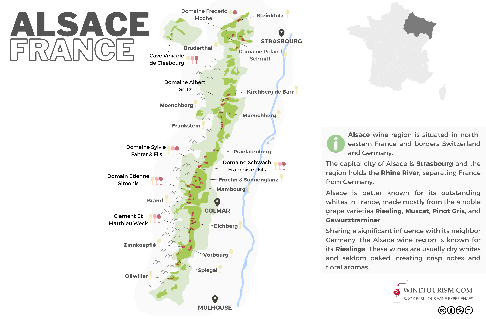

# CMS - Alsace

## TOC

<!-- vim-markdown-toc GFM -->

- [Introductory](#introductory)
  - [01 Factors affecting Climate](#01-factors-affecting-climate)
  - [02 Importance of the Vosges](#02-importance-of-the-vosges)
  - [03 Subdistricts](#03-subdistricts)
  - [04 Location of the best vineyards and variety of soils](#04-location-of-the-best-vineyards-and-variety-of-soils)
  - [05 Grape Varietals](#05-grape-varietals)
  - [06 Appellations of Alsace](#06-appellations-of-alsace)
    - [Alsace Grand Cru](#alsace-grand-cru)
    - [Crémant](#crémant)
    - [AOC Alsace](#aoc-alsace)
      - [Communale (Villages)](#communale-villages)
      - [Lieu dit (Locations)](#lieu-dit-locations)
  - [06 Styles of wine VT and SGN](#06-styles-of-wine-vt-and-sgn)
  - [07 Labelling Terms](#07-labelling-terms)
- [Certified](#certified)
  - [01 Identify Grand Cru Varietals and Sites](#01-identify-grand-cru-varietals-and-sites)

<!-- vim-markdown-toc -->

## Introductory

### 01 Factors affecting Climate

- Vosges:
  - rainshadow: sunniest and driest climates of any winemaking area in France.
- semi-continental
- Rhine river.

### 02 Importance of the Vosges

- Provides a rainshadow over the area generating an exceedingly dry and sunny climate.
- Foothulls and slopes:
  - drainage
  - south east and eastern slope exposure maximising sunlight.

### 03 Subdistricts

- alsace is divided into two departments: Haut-Rhin and Bas-Rhin
- Haut-Rhin contains generally higher wuality wine - 2/3 grcu vineyards

### 04 Location of the best vineyards and variety of soils

- Location of best vineyards:
  - 2/3 gcru in Haut-Rhin
  - east a d south eastern exposure in the best vineyards
- soil types:
  - granite
  - limestone
  - schist
  - clay
  - gravel
  - chalk
  - loess
  - gres de vosges (pink sandstone)
  - steeper mountain slopes consist of schist, granite, volcanic sediment.
  - lower slopes possess limestone _base_
  - valley floor rich alluvial clay and gravel soils

### 05 Grape Varietals

- Nobles Grapes:
  - Riesling
  - Pinot Gris
  - Muscat
  - Gewurtztraminer
- Others:
  - Pinot Noir
  - Pinot Blanc
  - Chasselas
  - Sylvaner
  - Auxerrois

### 06 Appellations of Alsace

- Alsace./Vin d'Alsace AOP
- Crémant d'Alsace AOP
- Côtes de Toul AOP:
  - PN rouge
  - Auxerrois and Aubin blanc
  - Gamay and Pinot Noir blend vin gris
- Moselle AOP:
  - Auxerrois white, Pinot Noir rouge, rosé
- Alsace Grand Cru AOP:
  - Schlossberg
  - 51 in total.
  - notable:
    - Schlossberg (first)
    - Rangen
    - Altenberg de Bergbieten
    - Brand
    - Geisberg
    - Muenchberg
    - Vorbourg
    - Schoenenbourg

#### Alsace Grand Cru

- originated in 1975
- orginally just schlossberg vineyard
- 51 GC now
- only the noble grapes
- generally single-varietal (altenberg de mnhrim and kaefferkopf can blend)
- zotzenberg can use sylvaner
- hengst, kirchberg de barr and Hengst vineyards can bottle GC PN
- handharvesting required
- 2011 moved to individual GC vineyard appellations like cote d’or
- Because Alsace GC AOP is inconsistent some producers choose not to use
- required to note the lieu-dit name

Sources:

- [@vinalsace_grandcruaop]

#### Crémant

- sparkling wine
- styles and encapagement:
  - mousseaux blanc: ri, pb, pn, pg, ax, ch
  - rose: pn
- minimum alc: 9%
- minimum must weight: 144g/L
- other:
  - traditional method
  - 9 months on lees before disgorgement
  - 12 mths total ageing with 9 months on leess from 2012
  - minimum 4 atm of pressure
- harvesting: manual
- minimum density: 4000 vines per hectare
- established 1976

#### AOC Alsace

- introduced in 1962
- in 2011 the subcategories of Communales and Lieux-dits were introduced.
- monovarietal or blend (edelzwicker)
- bottled in “wine of the Rhine” /Flute of Alsace
- overlooked by INAO

Sources:

- [@vinsalsace_alsaceaoc]

##### Communale (Villages)

- 14 communes
- AOC Alsace:
  - Bergheim
  - Blienschwiller
  - Côtes de Barr
  - Côte de Rouffach
  - Coteaux du Haut-Koenigsbourg
  - Klevener de Heiligenstein
  - Ottrott
  - Rodern
  - Saint-Hippolyte
  - Scherwiller
  - Vallée Noble
  - Val Saint-Grégoire
  - Wolxheim
- restrictions:
  - varietals planted
  - vine density
  - pruning
  - trellising
  - grape maturity
  - yields

##### Lieu dit (Locations)

- A named vineyard
- more stringent restrictions than Communales
- label the name of the vineyard alongside the AOC/AOP

Sources:

- [@vinsalsace_alsaceaoc]

### 06 Styles of wine VT and SGN

- Vendanges de Tardives and Sélections de Grains Nobles added in 1984
- imply sweetness but not required
- apply to both Alsace AOP and Alsace GC AOP wines
- require the wine to be single-varietal and pass a blind-tasting
- hand-harvested
- SGN:
  - botrytised
  - favor botrytis character over varietal
  - fruit picked in tries
  - generally always sweet
  - picking conc (g/L) musc, ri / pg, gw: 276 / 306
- VT:
  - botyrtised (maybe)
  - fsvor varital character over botrytis.
  - passerillage (raisinating fruit)
  - sweet and dry(ish)
  - picking sugar conc: 224 g/l for muscat and ri, 270 for PG And GW

### 07 Labelling Terms

- General:
  - vineyard name
  - grape variety
  - appellation title
  - producer name
  - estste bottling statement
  - producer location
  - alcohol percentage.
- Alsace GC:
  - “Alsace Grand Cru”
  - vineyard name
  - grape variety
- Alsace AOC:
  - “Alsace AOC”
  - (optional): GI
  - (optional): vineyard name
  - (compulsory): variety, or “Edelzwicker” indicates a white blend
- Sparkling wine:
  - Cremant d’Alsace
- VT and SGN

## Certified

### 01 Identify Grand Cru Varietals and Sites

- 2/3 in Haut Rhin
- single varietal wines made from noble grapes only except some exceptions
- schlossberg first gc vineyard in 1975
- exceptions:
  - altenberg de bergheim and kaefferkopf can use blends
  - zotzenberg can use slyvanar
  - Hengst, Kirchberg de Barr, and Vorbourg can make Pinot Noir

Sources:

- [@cms_alsacejurasavoie]
