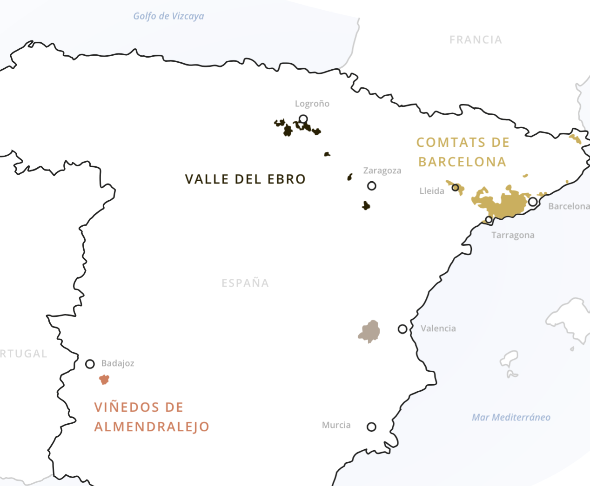

# Sparkling Wines

## TOC

<!-- vim-markdown-toc GFM -->

- [Intro](#intro)
  - [01 Methods of Production](#01-methods-of-production)
    - [Traditional](#traditional)
      - [Key Steps](#key-steps)
      - [Champagne-specific Terms](#champagne-specific-terms)
      - [Full Méthode Champenoise Outline](#full-méthode-champenoise-outline)
        - [1. Press](#1-press)
        - [2. pre-ferment processing](#2-pre-ferment-processing)
        - [3. primary fermentation](#3-primary-fermentation)
        - [4. secondary fermentation](#4-secondary-fermentation)
        - [5. clarification:](#5-clarification)
        - [6. maturation](#6-maturation)
        - [7. blending (_assemblage_)](#7-blending-_assemblage_)
        - [8. post-blending processing](#8-post-blending-processing)
        - [9. second fermentation (_prise de mousse_)](#9-second-fermentation-_prise-de-mousse_)
        - [10. bottle lees maturation](#10-bottle-lees-maturation)
        - [11. dégorgement](#11-dégorgement)
        - [12. dosage (_liqeur d'expédition_)](#12-dosage-_liqeur-dexpédition_)
    - [Charmat](#charmat)
    - [Ancestral](#ancestral)
  - [02 Synonyms of Traditional Method](#02-synonyms-of-traditional-method)
  - [03 Alternate Appellations for Sparkling Wines: Cremant, Cava](#03-alternate-appellations-for-sparkling-wines-cremant-cava)
    - [Cremant Appellations](#cremant-appellations)
    - [Cava Appellations](#cava-appellations)
    - [Italy](#italy)
  - [04 Principal Sparkling Wines of Other European Countries](#04-principal-sparkling-wines-of-other-european-countries)
  - [05 Sparking wines from New World Countries: New Zealand, Australia](#05-sparking-wines-from-new-world-countries-new-zealand-australia)
    - [Sparkling Wine of Australia](#sparkling-wine-of-australia)
    - [Sparkling Wines of New Zealand](#sparkling-wines-of-new-zealand)
- [Cert](#cert)
  - [01 Wines and Grape Varietals Used in Principal Sparkling Wines Produced in Major Wine Countries](#01-wines-and-grape-varietals-used-in-principal-sparkling-wines-produced-in-major-wine-countries)

<!-- vim-markdown-toc -->

## Intro

### 01 Methods of Production

#### Traditional

##### Key Steps

1. Press
2. Pre-ferment processing
3. primary fermentation
4. secondary fermentation (MLF)
5. clarification
6. maturation
7. blending
8. post-blending processing
9. second primary fermentation
10. bottled lees maturation
11. disgorgement (dégorgement)
12. dosage

##### Champagne-specific Terms

- _vin de cuvée_: first 2050L of press
- _vin de taille_: remaining 500L of press
- _rebêche_: 1 - 10% of total extraction put aside to make distillate
- _débourbage_: post-press settling at cool temperature
- _vins clairs_: high aid base wine used as the base of Champagne
- _assemblage_: blending of base wine, usually after maturation.
- _prise de mousse_: second fermentation of champagne wine to add carbonation
- _liqeur de tirage_: mix of still wine, yeast, sugar and fining agents to kick-start a second fermentation _prise de mousse_
- _bidule_: device used to capture lees sediment during _remuage_.
- _sur latte_: storing of bottles on their side during _prise de mousse_.
- _dégorgement_: removal of lees after maturation period following _prise de mousse_.
- _remauge_: the act of moving the precipitated lees to the bottle neck prior to _dégorgement_.
- _pupitre_: a A frame shaped rack designed to hold bottles at an acute angle to allow for _remauge_.
- _remeur_: someone who performs _remuage_.
- gyropalette: modern form of _remauge_, automated.
- _sur pointe_: the storage of bottles vertically following _remauge_ to gather any remaining fine lees.
- _dégorgement_ à la glace\_: removal of lees following \_sur pointe\* through application of an ultra-cold brine solution which solidifes the lees. Once the bottle is opened the solid lees are pushed out by the internal pressure.
- _liqeur d'expédition_: mixture of sugar syrup and wine used to top up following _dégorgement_ and determine final sweetness level.

##### Full Méthode Champenoise Outline

###### 1. Press

- extraction limit: 2550L/4000kg (one _marc_) = 102L/160 kg = 66L/ha
- juice division: first 2050L dubbed _vin de cuvée_, remaining 500L _vin de taille_
- second press _rebêche_ required by law to amount 1 - 10% of total extraction, used for distillate

###### 2. pre-ferment processing

- settle (_débourbage_):
  - cool temperature
  - 8 - 15 hours
  - solids (_bourbes_) racked after setting before ferment
- chaptalization (optional)

###### 3. primary fermentation

- result = high-acid base wine (_vins clairs_)
- fermented to 11% alcohol
- steel or used oak barrels, sometimes new

###### 4. secondary fermentation

- MLF (common not req.)

###### 5. clarification:

- fining/filtering/centrifuge

###### 6. maturation

- vessel: steel, barrel, sometimes Bottle
- until late feb / march year following harvest

###### 7. blending (_assemblage_)

- house blend formed (NV)
- base red added (rosé)

###### 8. post-blending processing

- cold stabilization
- racking

###### 9. second fermentation (_prise de mousse_)

- bottled
- _liqeur de tirage_ added (mix of still wine, yeasts, sugar, and fining agents)
- sealed with crown cap and bidule (captures sediment during _remuage_)
- up to 8 weeks of fermentation
- alcohol increases 1.2 - 1.3%
- CO2 creates pressure of 5 - 6 atm.
- bottles stored horizontally (_sur latte_)
- autolysis forms sediment (lees)

###### 10. bottle lees maturation

- minimum 12 months for NV wine

###### 11. dégorgement

- removal of lees from bottle after maturation period.
- riddling / _remuage_:
  - sharp twists + bottle inversion
  - _pupitre_:
    - A frame storage structure with angled holes to hold the bottles inverted.
    - a _remeur_ slowly turns the bottles over the maturation time to coax the lees into the _bidule_
  - gyropalette:
    - automates function of _pupitre_.
    - has replaced _pupitre_ in all major houses apart from some prestige cuvée
- bottles inverted and all lees in neck is a state called _sur pointe_.
- _sur pointe_ for short time to allow fine lees to gather (somtimes much longer see Bollinger RD)
- dégorgement à la glace:
  - neck of bottle dipped in freezing brine solution
  - bottle turned upright
  - internal pressure pushes sediment (and small vol. wine) out once crown cap opened

###### 12. dosage (_liqeur d'expédition_)

- liquid mixture of sugar syrup and wine
- conc. of sugar determines final sweetness level

#### Charmat

- also known as tank method
- process:
  - make a still base wine
  - put it in a pressurised tank
  - add yeast and sugar to begin 2nd ferment
  - wait 1 - 6 weeks
  - chill to 0°C to stop ferment
  - dosage mix of wine and sugar to achieve desired sweetness level
  - filter and bottle
- secondary ferment in large steel autoclaves

#### Ancestral

- méthode rurale
- single fermentation in tank
- wine transferred to bottle before primary fermentation complete
- yeast ferments remaining sugars, building up pressure through carbonation
- wine may be disgorged, filtered and rebottled
- note: no liqueur de tirage or dosage

### 02 Synonyms of Traditional Method

- méthode champenoise
- méthode traditionnelle
- método tradicional
- metodo classico
- metodo tradizionale
- klassische Flaschengärung
- Methode Cape Classique

### 03 Alternate Appellations for Sparkling Wines: Cremant, Cava

#### Cremant Appellations

The following is a list of french appellations of Crémant wine:

- Crémant de Bordeaux
- Crémant de Bourgogne
- Crémant dde Loire
- Crémant de Limoux
- Crémant de Die
- Crémant du Jura
- Crémant d'Alsace
- Vin de Savoie (Crémant de Savoie)

#### Cava Appellations

The following is a list of Cava appellations:

- Cava DO

#### Italy

The following is a list of traditional method sparkling wine appellations in italy:

- Franciacorta DOCG
- Oltrepò Pavese Metodo Classico DOCG

### 04 Principal Sparkling Wines of Other European Countries

- Italy; Franciacorta
- Italy: Prosecco
- Spain: Cava
- Germany: Sekt
- Austria: Sekt
- South Africa: Cape Classique

### 05 Sparking wines from New World Countries: New Zealand, Australia

#### Sparkling Wine of Australia

- Hunter Valley
- Tumbarumba GI
- Adelaide Hills GI
- Tasmania

#### Sparkling Wines of New Zealand

- Marlborouugh

## Cert

### 01 Wines and Grape Varietals Used in Principal Sparkling Wines Produced in Major Wine Countries

- Champagne: PN, CH, Meun.
- Sekt: riesling
- Cape Classique: PN, CH, Meun., CB
- Prosecco: Glera
- Franciacorta: PN, CH, Meun.
- Cava: Paralleda, Xarel-lo, Macabeu
