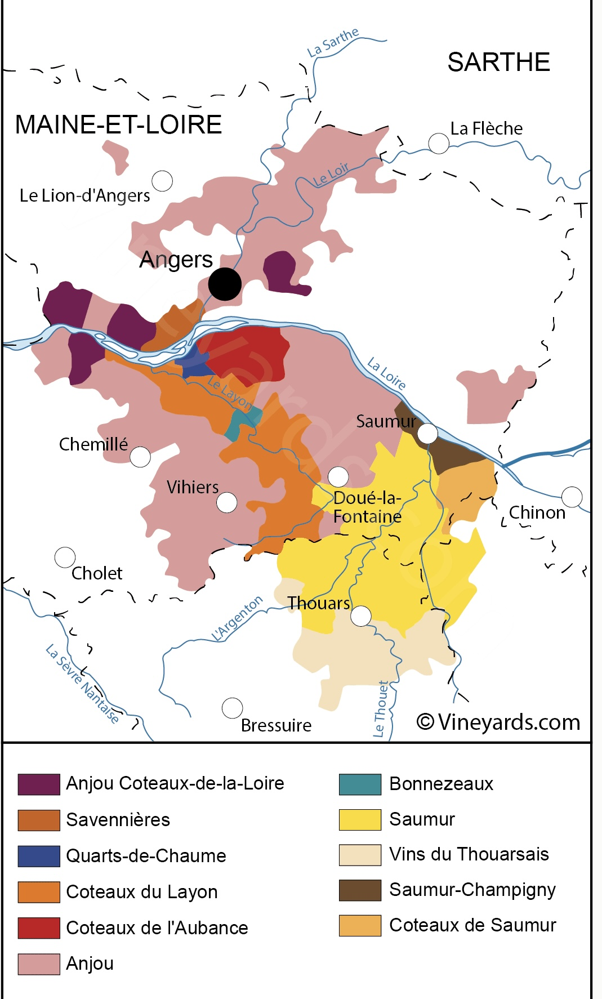
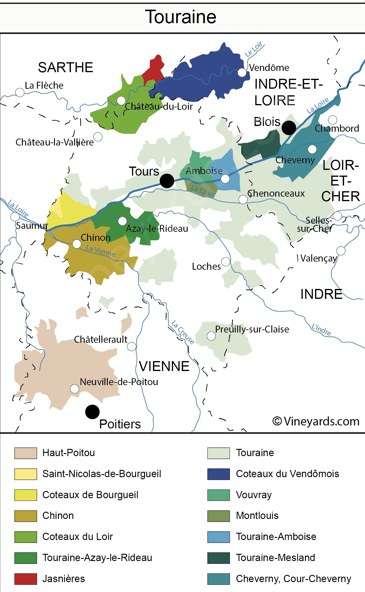
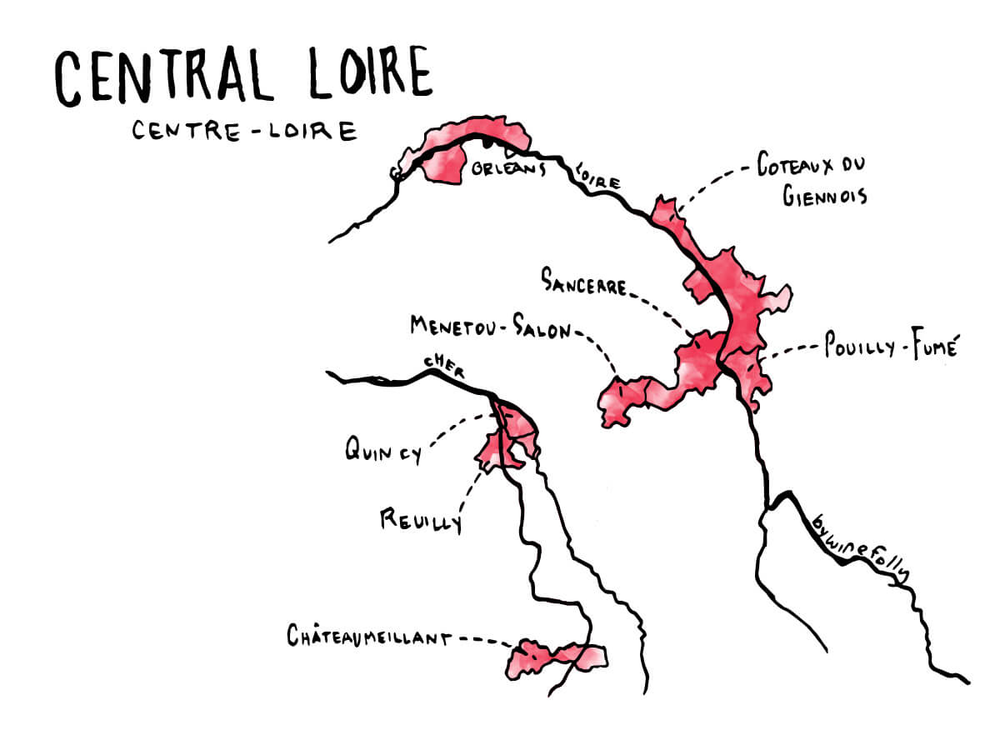

# Loire Valley

TODO: complete refactoring of sections.

## TOC

<!-- vim-markdown-toc GFM -->

* [01 Intro](#01-intro)
  * [01.01 Pays Nantais](#0101-pays-nantais)
    * [01.01 Climatic Influences](#0101-climatic-influences)
    * [01.02 Principal Soil Types](#0102-principal-soil-types)
    * [01.03 Districts and Sub-Districts of the Region](#0103-districts-and-sub-districts-of-the-region)
    * [01.04 Principal Grape Varietals and Wines Produced From Them](#0104-principal-grape-varietals-and-wines-produced-from-them)
    * [01.05 Styles of Wine](#0105-styles-of-wine)
    * [01.06 Principal AOP's](#0106-principal-aops)
    * [01.07 Labelling Terms](#0107-labelling-terms)
  * [01.02 Anjou-Saumur](#0102-anjou-saumur)
    * [01.02.01 Climatic Influences](#010201-climatic-influences)
    * [02.01 Principal Soil Types](#0201-principal-soil-types)
    * [02.03 Districts and Sub-Districts of the Region](#0203-districts-and-sub-districts-of-the-region)
    * [02.04 Principal Grape Varietals and Wines Produced From Them](#0204-principal-grape-varietals-and-wines-produced-from-them)
    * [02.05 Styles of Wine](#0205-styles-of-wine)
    * [02.06 Principal AOP's](#0206-principal-aops)
    * [02.07 Labelling Terms](#0207-labelling-terms)
  * [03 Touraine](#03-touraine)
    * [03.01 Climatic Influences](#0301-climatic-influences)
    * [03.02 Principal Soil Types](#0302-principal-soil-types)
    * [03.03 Districts and Sub-Districts of the Region](#0303-districts-and-sub-districts-of-the-region)
    * [03.04 Principal Grape Varietals and Wines Produced From Them](#0304-principal-grape-varietals-and-wines-produced-from-them)
    * [03.05 Styles of Wine](#0305-styles-of-wine)
* [- silky tannin](#--silky-tannin)
    * [03.06 Principal AOP's](#0306-principal-aops)
  * [04 Central Vineyards](#04-central-vineyards)
    * [04.01 Climatic Influences](#0401-climatic-influences)
    * [04.02 Principal Soil Types](#0402-principal-soil-types)
    * [04.03 Districts and Sub-Districts of the Region](#0403-districts-and-sub-districts-of-the-region)
    * [04.04 Principal Grape Varietals and Wines Produced From Them](#0404-principal-grape-varietals-and-wines-produced-from-them)
    * [04.05 Styles of Wine](#0405-styles-of-wine)
    * [04.06 Principal AOP's](#0406-principal-aops)
  * [07. Labelling Terms](#07-labelling-terms)
* [Certified](#certified)
  * [01. Principal Wines](#01-principal-wines)
  * [02. Grape Variety Synonyms](#02-grape-variety-synonyms)
  * [03. Sur Lie Aging Requirements](#03-sur-lie-aging-requirements)
  * [04. Smaller AC's of the Loire and Wines Produced](#04-smaller-acs-of-the-loire-and-wines-produced)
    * [St. Pourcain AOP](#st-pourcain-aop)
    * [Cheverny AOP](#cheverny-aop)
    * [Orleans AOP](#orleans-aop)

<!-- vim-markdown-toc -->

## 01 Intro

### 01.01 Pays Nantais

#### 01.01 Climatic Influences

- cool
- wet
- maritime (Atlantic)

#### 01.02 Principal Soil Types

- Sèvre-et-Maine AOP: mix of gneiss, silica, clay, granite

#### 01.03 Districts and Sub-Districts of the Region

NAN

#### 01.04 Principal Grape Varietals and Wines Produced From Them

- Melon de Bourgogne: Muscadet

#### 01.05 Styles of Wine

- Muscadet:
  - neutral
  - bone dry to dry
  - high acid
  - designed for youthful consumption
- Muscadet Sur Lie:
  - sur lie:
    - wine must originate from one of the sub appellations of Muscadet Sèvre-et-Maine AOP
    - wine is aged on lees over winter
    - bottled without filtering between March 1 and November 30 of year following harvest
    - adds:
      - complexity
      - richness
      - petillance

#### 01.06 Principal AOP's

- Muscadet Sèvre-et-Maine AOP:
  - located near around confluence of the Sèvre and Maine rivers
  - half of production is sur lie
- Muscadet Coteaux de la Loire AOP:
  - north of Muscadet Sèvre-et-Maine AOP
  - wines are leaner
  - excellent fruit in warmer vintages
- Muscadet Côtes de Grandlieu AOP:
  - neweset appellation
  - middling wine

#### 01.07 Labelling Terms

- sur lie

### 01.02 Anjou-Saumur

#### 01.02.01 Climatic Influences

- northerly
- mild contental climate
- some maritime influence from Atlantic
- forests of Vendee to southwest reduce rainfall and wind from atlantic.
- Mists from Layon help for botrytis: Quarts de Chaume, Coteaux de Layon

#### 02.01 Principal Soil Types

- Savennières AOP: blue schist and volcanic soils
- Saumur: Soft tuffeau limestone (like Touraine)
- Champigny: _field of fire_, hard limestone, iron-rich with shale
- Quarts de Chaume AOP: sandstone and schist

#### 02.03 Districts and Sub-Districts of the Region

- Anjou: west-side
- Suamur:
  - east-side
  - west of Chinon (Touraine)

#### 02.04 Principal Grape Varietals and Wines Produced From Them

- Chenin Blanc:
  - slow to ripen
  - retains high acidity in cooler Anjou
  - wine character:
    - astringent
    - aggressive acidity
    - bitterness
  * Anjou:
    - sweet
    - dry
- Grolleau:
  - rosé
- Cabernet Franc:
  - red:
    - often blended with CS to reinforce
- Gamay:
  - red
- Pineau d'Aunis:
  - red

#### 02.05 Styles of Wine

- all styles
- Anjou:
  - white:
    - dry CB
  - sweet:
    - sweet CB
    - late harvest whites
    - botrytised whites
  - rose:
    - Grolleau blends
  - red:
    - Gamay
- Saumur:
  - sparkling:
    - méthode traditionelle
  - red
  - white
  - rosé

#### 02.06 Principal AOP's

- Anjou:
  - Anjou AOP:
    - red white and sparkling
    - can include wines from Saumur
  - Savennières AOP:
    - southern exposure
    - 100% Chenin Blanc
    - dry
    - austere and rigid in youth
    - complexity and honeyed richness with age
    - subappellations:
      - Roche Aux Moins (Savennières)
      - Coulée de Serrant (Savennières):
        - monopole of Nicholas Joly
  - Coteaux du Layon AOP:
    - harvest in tries
    - late harvest wine
    - botrytised wine
  - Coteaux de l'Aubance AOP:
    - harvest in tries
    - late harvest wine
    - botrytised wine
  - Quarts de Chaume AOP:
    - between Coteaux de l'Aubance and Coteaux de Layon
    - grand cru from 2010
    - botrytised white
  - Anjou-Villages AOP:
    - red wine
    - CF wines blended with CS
  - Anjou Brissac AOP:
    - red wine
    - same geographical area as Coteaux de l'Aubance AOP
- Saumur:
  - Saumur AOP:
    - dry white:
      - 100% CB
    - rosé
    - red:
      - varietals:
        - CF
        - CS
        - Pineau d'Aunis
    - sparkling
- Saumur-Champigny AOP:
  - red:
    - Cabernet Franc
- Haut-Poitou AOP:
  - south of Chinon
  - Eastern edge of Saumur
  - white: Sauvignon Blanc, Sauvignon Gris blends
  - red: Cabernet Franc
  - rose: Cabernet Franc

#### 02.07 Labelling Terms

NAN

### 03 Touraine

#### 03.01 Climatic Influences

- half maritime, half continental [winesearcher](https://www.wine-searcher.com/regions-touraine)

#### 03.02 Principal Soil Types

- Chinon:
  - tuffeau (slopes):
    - deepest and most ageworthy wine comes from tuffeau soil.
  * clay
  * varennes:
    - near the Vienne river
    - sandy, alluvial soil
- Bourgeil:
  - sand
  * limestone
- Saint-Nicolas-de-Bourgeil:
  - light alluvial soil
  - lightest wines
- Vouray: tuffeau subsoil

#### 03.03 Districts and Sub-Districts of the Region

- Touraine
- Loir

#### 03.04 Principal Grape Varietals and Wines Produced From Them

- Cabernet Franc:
  - rouge
- Chenin Blanc:
  - blanc
  - sparkling
- Orbois:
  - blanc

#### 03.05 Styles of Wine

- CF rouge:
  - raspberry
  - green tobacco
  - silky tannin
-

#### 03.06 Principal AOP's

- general:
  - Touraine AOP:
    - blanc:
      - Sauvignon Blanc, Sauvignon Gris blends
    - rouge:
      - Gamay:
        - may be produced in Nouveau style
      - Groslot
      - Pineau d'Aunis
      - Cabernet Franc
    - sparkling
  - Touraine Noble-Joué AOP:
    - vin gris:
      - Gris Meunier
      - Malvoisie
      - Pinot Noir
- west:
  - Chinon AOP:
    - red: CF
    - white: CB
  - Bourgeil AOP:
    - red: CF
    - rosé
  - Saint-Nicolas-de-Bourgeil AOP:
    - red: CF
    - rosé
    - lighter wines compared to Chinon and Bourgeil
- center:
  - Vouray AOP:
    - most important white wine district
    - 8 communes
    - white: CB, can use Orbois
    - blanc:
      - sec
      - sec-tendre (off-dry)
      - demi-sec
      - moelleux
      - liquoreux
    - sparkling
  - Montlouis-sur-Loire AOP:
    - same as Vouray
    - no Orbois
- north:
  - Loir:
    - Coteaux du Loir AOP:
      - north
      - red blends: Pineau d'Aunis
      - rose: Pineau d'Aunis
      - white: Chenin Blanc
    - Jasnières AOP:
      - white: chenin blanc
    - Coteaux du Vendômois AOP:
      - red
      - white
      - rosé: 100% Pineau d'Aunis
- east:
  - Cheverny AOP:
    - red:
      - PN, Gamay
      - light
    - SB:
      - lean
  - Cour-Cheverny AOP:
    - Romorantin:
      - dry
      - off-dry
- south:
  - Valençay AOP:
    - white: SB
    - red: Gamay, PN, Côt
    - rosé: Gamay, PN, Côt

### 04 Central Vineyards

#### 04.01 Climatic Influences

- continental - as continental as [possible](https://www.thewinedoctor.com/regionalguides/loire_centre_02_climate.shtml)
- frost
- short summer

#### 04.02 Principal Soil Types

- Sancerre:
  - silex (flint)
  - terres blanches (kimm. marl)
  - caillotes (stone + fossils)
- Pouilly-Fume:
  - silex

#### 04.03 Districts and Sub-Districts of the Region

NAN

#### 04.04 Principal Grape Varietals and Wines Produced From Them

- Sauvignon Blanc:
  - dry white
- Pinot Noir:
  - light reds
- Chasselas:
  - white
- Gamay
- Chardonnay
- Pinot Meunier
- Cabernet Franc
- Pinot Gris

#### 04.05 Styles of Wine

- dry white
- dry red
- rosé
- vin gris

#### 04.06 Principal AOP's

- Sancerre AOP
- Pouilly-Fumé AOP
- Pouilly-sur-Loire AOP:
  - white: Chasselas
- Menetuou Salon AOP:
  - similar to Sancerre
  - SB, PN
- Reuilly AOP:
  - red: PN
  - rosé:
    - vin gris from PG
- Quincy AOP:
  - white
  - second demarcated appellation in France
- Coteaux du Giennois AOP:
  - red
  - rosé
- Orléans AOP:
  - white: Chardonnay
  - red: Meunier
  - rosé: Meunier
- Orléans-Cléry AOP

### 07. Labelling Terms

- Sur Lie:
  - originate from one of:
  - Muscadet Coteaux de la Loire AOP
  - Muscadet Côtes de Grandlieu AOP
  - Muscadet Sèvre-et-Maine AOP
  - wines are matured _Sur Lie_.
  - Not specify sub-appellation.
- Val de Loire:
  - EU IGP indicating the wine is from the Loire Valley. Optional.
- sweetness level:
  - sec: dry
  - Demi-Sec: offdry
  - Moelleux: sweeter
  - Doux: very sweet.

## Certified

### 01. Principal Wines

- Coteaux du Layon:
  - sweet botyrtised affected wine made from Chenin Blanc
- Savennières:
  - dry whites from CB
- Central Vineyards:
  - Sauvignon Blanc
  - Pinot Noir
- Anjou-Saumur:
  - saumur:
  - sparkling
  - dry whites from CB, SB and SG
  - reds from CF, CS and/or Pineau d'Aunis
  - anjou:
  - CB (sweet and dry)
  - rose from grolleau
  - red from CF or blends of CF/CS
- Touraine:
  - reds from CF
  - rosé
  - CB white at all sweetness levels
  - sparkling at petillant or mousseaux level (?) (what variety?)
  - sauvignon blanc
  - Gamay
- Muscadet:
  - dry white from melon de bourgogne (called Muscadet)

### 02. Grape Variety Synonyms

| Gen.    | Local                             |
| ------- | --------------------------------- |
| CF      | Breton                            |
| Malb    | Cot                               |
| Groslot | Grolleau                          |
| CB      | Pineau de la Loire, Plant d'Anjou |
| Melon B | Melon de Bourgogne                |

Sources:

- <https://flatiron-wines.com/blogs/the-latest/grapes-of-the-loire-valley>
- [winefolly](https://winefolly.com/deep-dive/loire-valley-wine-guide/)

### 03. Sur Lie Aging Requirements

- aged on lees over winter
- bottled without filtering (off the fine lees) between March 1 and November 30 year following harvest

### 04. Smaller AC's of the Loire and Wines Produced

TODO: add other AOC's.

#### St. Pourcain AOP

- southernmost and most remote region under Loire.
- Allier department.
- produce: Blanc, Rose, Rouge
- blanc: Chardonnay dominant whites
- Rose: Gamay
- Rouge: Gamay Pinot Noir blends.

#### Cheverny AOP

- Touraine, eastern edge.
- Rouge: Pinot Noir and Gamay
- White: lean Sauvignon Blanc dominant.

#### Orleans AOP

- Central Vineyards
- just east of Touraine
- all three wines
- rouge: large amount of PM
- blanc: large amount of CH
