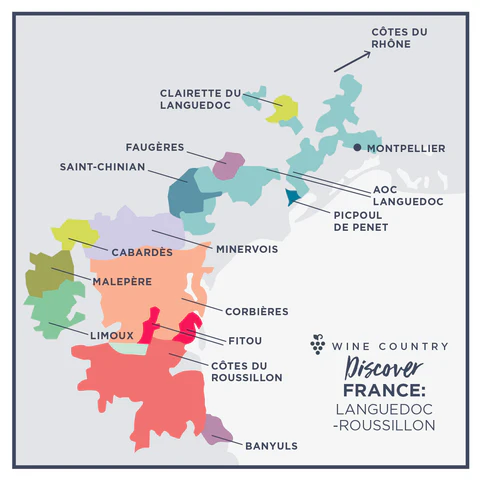
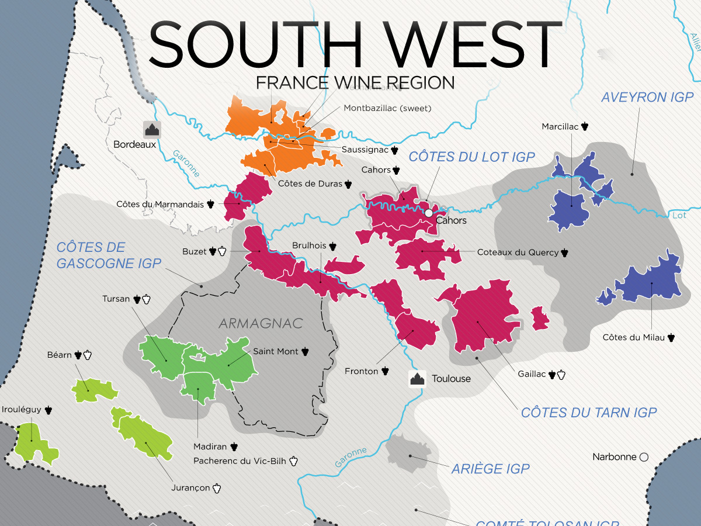

# South of France

# Intro

### 01 Climatic influences

### 02 Principal wines of: Provence, Languedoc, Roussillon, Bergerac, Madiran & Cahors

#### Principal Wines of Provence

- Cinsault, Grenache, Mourvèdre, Syrah blend rosés
- bandol reds (Mouvèdre blends)

#### Principal Wines of Languedoc

- Corbières AOP:
  - Carignan based red blends
- Minervois AOP:
  - Carignan based reds
  - Sable de Camargue AOP: Grenache rosé
- Muscat de Frontignan AOP: VDN or VDL

#### Principal Wines of Roussillon

- Rivesaltes AOP:
  - VDN
  - all styles: ambré, grenat, tuilé, rosé
  - Grenache, Maccabéo, Tourbat, Muscat of Alexandria, Muscat à Petits Grains
- Banyuls AOP:
  - VDN
  - Grenache blends
  - Banyuls Grand Cru AOP
- Côtes du Roussillon AOP:
  - Côtes du Roussillon Villages AOP
  * rosé

#### Principal Wines of Bergerac

- Monbazillac AOP: botrytised whites from Bordeaux Varieties.

#### Principal Wines of Madiran

- Gascony
- Tannat blends with CF, CS, Fer

#### Principal Wines of Cahors

- Cahors AOP: Malbec dominant blends with Tannat and Merlot.

### 03 Varietals used in principal wines and styles / qualities of wines produced

See [02 Principal wines of: Provence, Languedoc, Roussillon, Bergerac, Madiran & Cahors
](#02-principal-wines-of-provence-languedoc-roussillon-bergerac-madiran-cahors).

### 04 VDN & VDL wines of South France

- VDN:

  - Languedoc:
    - Muscat de Mireval AOP
    - Muscat de Lunel AOP
    - Muscat de Saint-Jean-de-Minervois AOP
    - Muscat de Frontignan AOP (Can be VDL as well)
    - note: Muscat de Frontignan most common
  - Roussillon:
    - Rivesaltes AOP / Muscat de Rivesaltes AOP
    - Banyuls/Banyuls Grand Cru AOP

- Sources:

- [@guildsomm_rhonevalleysouthern_2024, Languedoc-Roussillon]

### 05 Vin de Pays districts and locations

- Vin de Pays d'Oc: Covers Languedoc and Roussillon
- replaced by IGP in 2009

## Cert

### 01 In depth knowledge of wines of: Bergerac, Monbazillac, Pécharmant,Fitou, Cahors, Madiran, Corbières, Jura, Gaillac

#### Indepth Knowledge of Bergerac

- Sweet wine appellations:
  - Monbazillac AOP
  - Saussignac AOP
  - Rosette AOP
  - Haut-Montravel AOP
  - Côtes de Montravel AOP
- Monbazillac AOP: sweet wines from Bordeaux varieties including Muscadelle
- sandy soils
- use multiple tries for harvesting
- mechanical harvesting is banned
- Montravel AOP can produce dry red or white wines

#### Indepth Knowledge of Monbazillac

- In Bergerac region
- grapes: Muscadelle, Sauvignon Blanc, Sauvignon Gris, Sémillon
- produce dry blanc or SGN (Sélection de Grains Nobles)
- must harvest in successive tries

#### Indepth Knowledge of Pécharmant

- In Bergerac
- red blends from Cabernet Franc, CS, Merlot, Cot

#### Indepth Knowledge of Fitou

- In Languedoc
- Nested in Corbières
- Two districts: Fitou Maritime and Fitou Montagneux
- one of Languedoc-Roussillon's oldest AOPs, dates from 1948
- makes reds from Grenache, Charignan, Syrah, Mouvedre blends

#### Indepth Knowledge of Cahors

- Southwest France
- robust rustic reds from Malbec dom. blends with Tannat and Merlot

#### Indepth Knowledge of Madiran

- Southwest France
- Madiran AOP: Tannat dom. blends with CF, CS, and Fer
- Pacherenc du Vic-Bilh:
  - sweet wines from:
    - Petit Manseng
    - Petit Courbu
  - dry whites are labelled 'Sec'

#### Indepth Knowledge of Corbières

- Corbières AOP:
  - reds, whites, roseé
  - like Southern Rhone with hints of Spain
  - blanc:
    - Bourboulenc, Grenache Blanc, Marsanne, Macabeu, Marsanne, Vermentio
  - rosé:
    - Grenache, Lladoner Pelut, Mourvèdre, Syrah
  - Rouge:
    - Carignan, Grenahe, Lladoner Pelut, Mourvèdre, Syrah
  - subzones:
    - Boutenac: Carignan rouge
    - Fitou

#### Indepth Knowledge of Jura

- Jura Mountains
- Jurassic limestone and marl
- clay on lower sites
- continental climate
- harsh cold winter
- core apellation: Côtes du Jura AOP
  - red white and rosé
  - red: Poulsard, Trousseau, Pinot Noir
  - dry white: Chardonnay (Gamay Blanc), Savagnin (Naturé)
- other appellations:
  - Arbois AOP: Pupillin is a village that can attach its name to the aop
  - L'Etoile AOP:
    - named for a local fossil
  - Château Chalon AOP
- style:
  - Chardonnay, Pouslard, Savagnin
  - late bottling, oxidative style

#### Indepth Knowledge of Gaillac

- Southwest France
- satellite of the Dordogne
- some of the oldenst vineyards in France, established by the Romans
- red, white or rosé
- red: Duras, Fer, Syrah, and Prunelard
- white: Mauzac, Muscadelle, Len de l'El
- sweet white are labelled Gaillac Doux
- sparkling whiteS: Gaillac Mousseux
- sparkling wines are made by méthode Gaillaçoise (variante of m. ancestrale)

### 02 Vin de Paille wines

- dessert wine
- made by drying grapes on straw mats or hung
- concentration without losingacidity
- minimum 14% ABV
- aged 3 years with 18 months in neutral wood barrel

### 03 Provence & sub regions and wines

- east of Rhône basin
- pale-hued dry rosé
- Côtes de Provence AOP:
  - predom. rosé, can make red and white
  - roske' from brief skin contact, saignage or immediate pressing of whole grapes
  - no blending
  - Cinsault, Gernache, Mourvèdre, Syrah, Tibouren
  - traditionally bottled in 'skittle' bottles
  - rose and red:
    - Pierrefeu
    - Sainte-Victoire
    - Fréjus
    - Notre-Dame des Anges
    - La Londe (can do white as well)
- Bandol AOP:
  - rosé and clairette based whites
  - reds most premium
  - red: min. 50% Mourvèdre with Grenache, Cinsault, Syrah and Carignan
  - full-bodied, plummy, dense, animal character
  - 18 months in wood
  - need years of maturation
- dry warm Mediterranean climate
- organic viticulture common
- appellations:
  - Les Baux-de-Provence AOP
  - Coteauxd'Aix-en-Provense AOP:
    - warm hilltops
    - protected from Mistral
    - red and rosé based on Grenache, Syrah, Cinsault
    - whites: Grenache Blanc, Clairette, Vermentino, Roussanne
- other appellations (red, white and rose):
  - Cassis AOP
  - Palette AOP: better whites than reds
  - Bellet AOP:
    - better white than reds
    - Rolle for whites
    - red, white and rosé
  - Coteaux Varois en Provence AOP
- IGP designation often used as region still experimenting
- Grand cru classé:
  - first published in 1955
  - 23 estates

### 04 Varietals / blends

Refer to other sections
