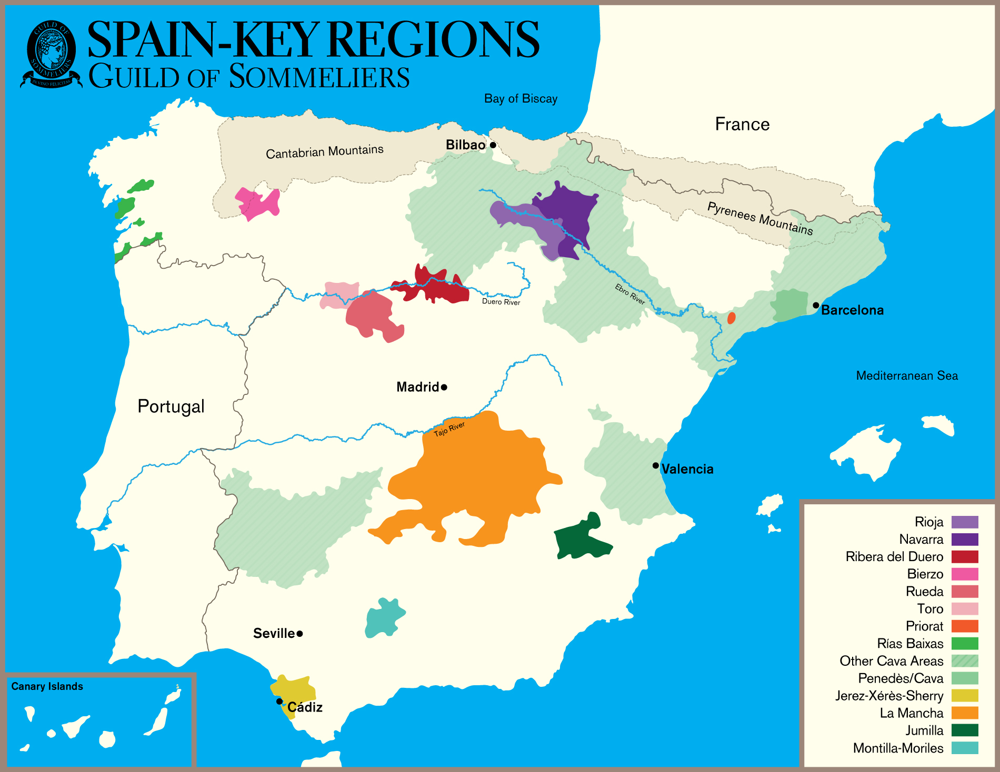
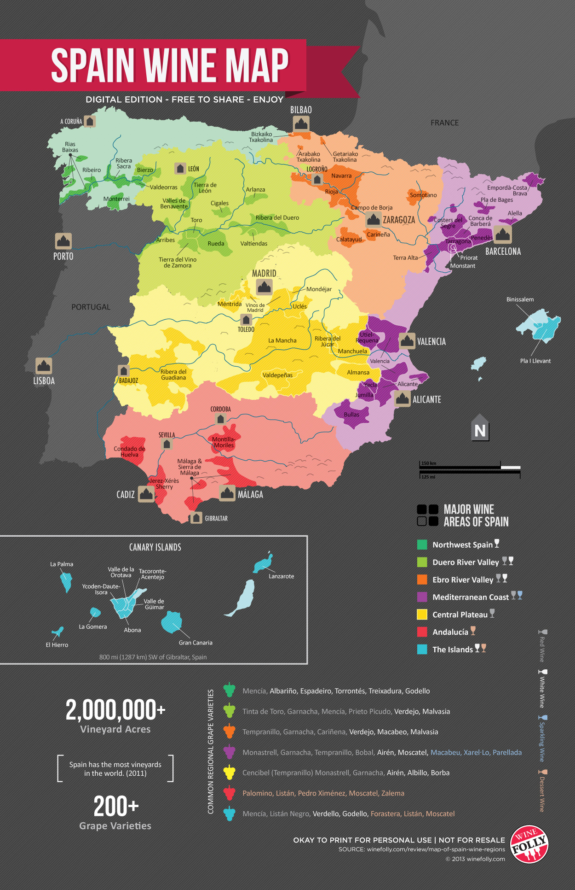
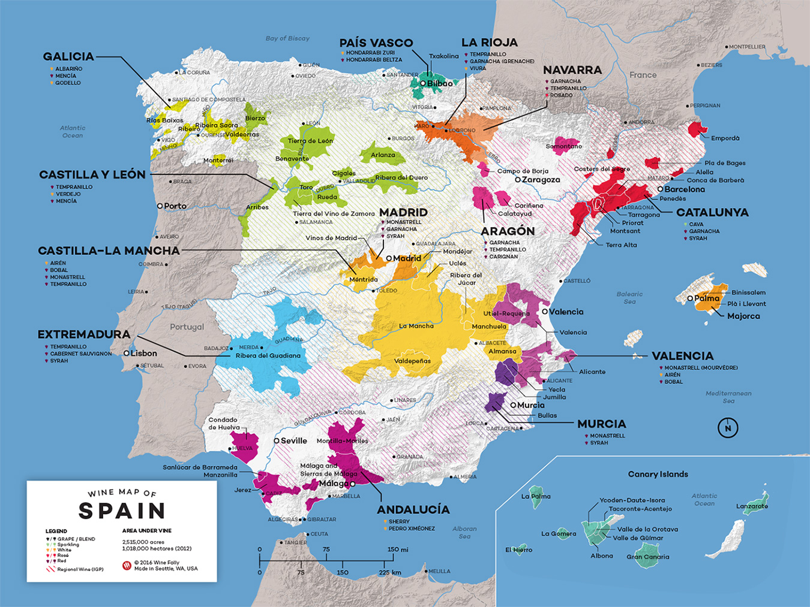
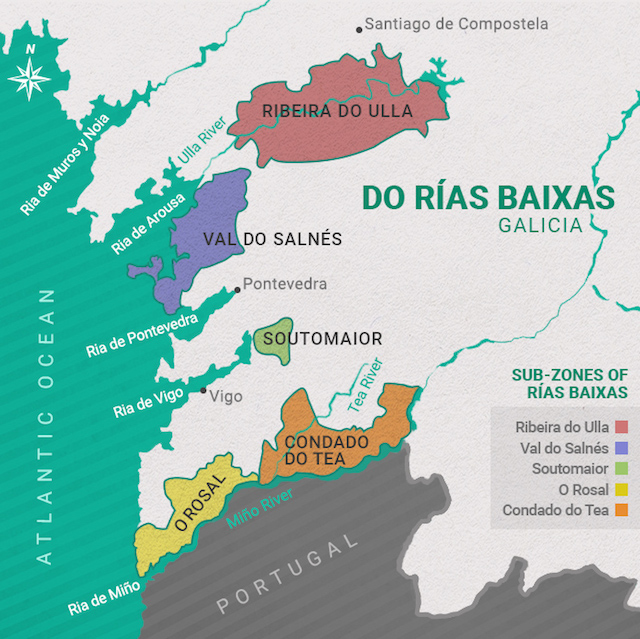
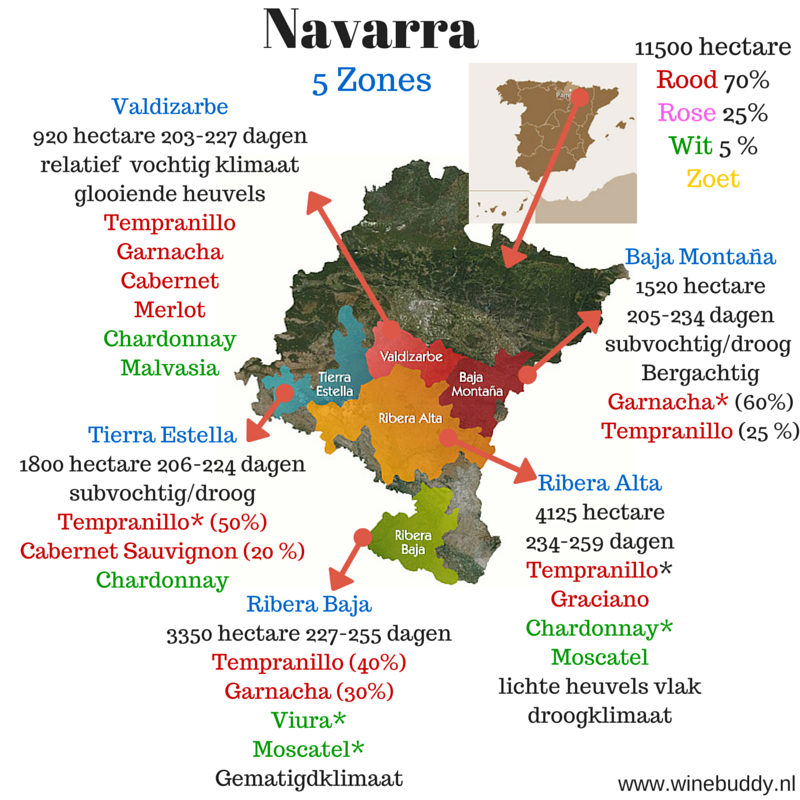
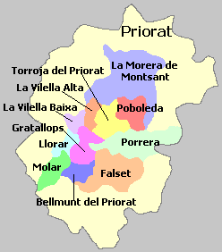
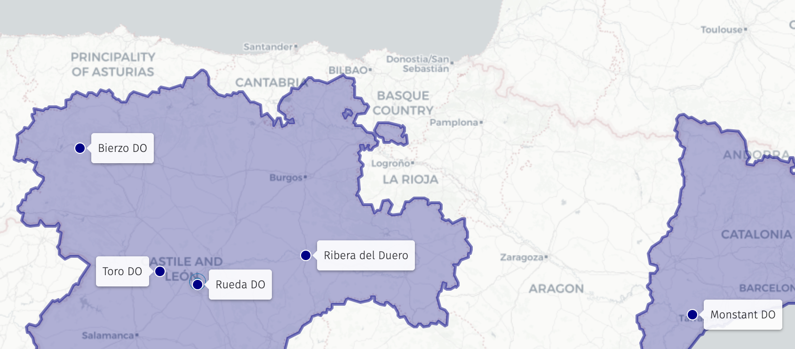

# Spain

## TOC

<!-- vim-markdown-toc GFM -->

- [Maps](#maps)
- [Intro](#intro)
  - [01 Climatic Influences](#01-climatic-influences)
  - [02 Quality structure for Spain: Vinos de la Tierra, DO DOCa Vinos de Pagos](#02-quality-structure-for-spain-vinos-de-la-tierra-do-doca-vinos-de-pagos)
  - [03 Wine districts of Spain & location](#03-wine-districts-of-spain--location)
  - [04 Principal varietals and synonyms of grapes: ie: Tempranillo, Mazuelo](#04-principal-varietals-and-synonyms-of-grapes-ie-tempranillo-mazuelo)
  - [05 Wine ageing regime & terms](#05-wine-ageing-regime--terms)
  - [06 Principal wines of main wine districts: Rías Baixas, Navarra, Rioja, Toro, Ribera del Duero, Penedes, Rueda, Priorat, Valdepeñas](#06-principal-wines-of-main-wine-districts-rías-baixas-navarra-rioja-toro-ribera-del-duero-penedes-rueda-priorat-valdepeñas)
  - [07 Styles of wine and varietals used](#07-styles-of-wine-and-varietals-used)
  - [08 Cava wine production](#08-cava-wine-production)
  - [09 Labelling terms](#09-labelling-terms)
- [Certified](#certified)
  - [01 Specific ageing requirements for Rioja wines](#01-specific-ageing-requirements-for-rioja-wines)
  - [02 DOCa’s of Spain](#02-docas-of-spain)
  - [03 Quality hierarchy: Rioja, Priorat](#03-quality-hierarchy-rioja-priorat)
    - [Quality Heirarchy in Rioja](#quality-heirarchy-in-rioja)
    - [Quality Heirarchy of Priorat](#quality-heirarchy-of-priorat)
  - [04 Sub districts of Rias Baixas, Navarra, Penedes & Priorat (Vino de Pueblo)](#04-sub-districts-of-rias-baixas-navarra-penedes--priorat-vino-de-pueblo)
    - [Sub-Districts of Rías-Baixas](#sub-districts-of-rías-baixas)
    - [Sub-Districts of Navarra](#sub-districts-of-navarra)
    - [Sub-Districts of Penedes](#sub-districts-of-penedes)
    - [Sub-Districts of Priorat](#sub-districts-of-priorat)
  - [05 Location of and wines produced in: Ribera del Duero, Montsant, Toro, Rueda, Bierzo](#05-location-of-and-wines-produced-in-ribera-del-duero-montsant-toro-rueda-bierzo)

<!-- vim-markdown-toc -->

## Maps

## Intro

### 01 Climatic Influences

- Three zones:

  - north-northwest:
    - moderate maritime climate
    - Atlantic ocean influence
    - high rainfall
  - east coast:
    - warm mediterranean climate
    - moderated by presence of Mediterranean Ocean and/or altitude
    - increasingly hot with southward progression
  - meseta-central:
    - extremely continental climate
    - hot
    - dry
    - heat moderated with altitude

- Green Spain:
  - cool maritime climate

### 02 Quality structure for Spain: Vinos de la Tierra, DO DOCa Vinos de Pagos

- DO and DOCa:
  - DO: Denominación de Origen
  - DOCa: Denominación de Origen Calificada
- first awarded in 1932
- DO Pago (Vinos de Pago):
  - superior estates within an existing DO
  - must show quality winemaking surpassing the current DO
  - must show a decades worth of quality production
- Vino de la Tierra:
  - known as Indicación de Origen Protegida (IGP) since 2016
  - still, sparkling, fortified
  - label:
    - can use Vino de la Tierra or IGP on label
    - can use vintage
    - can identify grape varieties

Sources:

- [Vino de la Tierra](https://en.wikipedia.org/wiki/Vino_de_la_tierra)

### 03 Wine districts of Spain & location

- North-Central Spain:
  - Navarra:
    - Navarra DO
  - La Rioja:
    - Rioja DOCa
  - Aragón:
    - Calatayud DO
    - Campo de Borja DO
    - Cariñena DO
    - Somontano DO
- Green Spain:
  - Locations:
    - Galicia
    - Austurias
    - Cantabria
    - País Vasco (Basque Country)
  - DO:
    - Rías Baixas DO
    - Ribeiro DO
    - Valdeorras DO
    - Riberira Sacra DO
    - Monterrei DO
- Castilla y León:
  - DO:
    - Ribera del Duero DO
    - Rueda DO
    - Toro DO
    - Tierra del Vino de Zamora DO
    - Arribes DO
    - Arlanza DO
    - Cigales DO
    - León DO
    - Bierzo DO
- Catalunya:
  - Priorat DOCa
  - Montsant DO
  - Tarragona DO
  - Tierra Alta DO
  - Conca de Barberà DO
  - Costers del Segre DO
  - Penedès DO
  - Alella DO
  - Empordà DO
  - Catalunya DO
  - Pla i Llevant DO
  - Binissalem Mallorca DO
- Southern Spain:
  - Valencia:
    - Valencia DO
    - Alicante DO
    - Utiel-Requena DO
  - Levant:
    - Jumilla DO
    - Yecla DO
    - Bullas DO
  - Castilla-La Mancha
    - La Mancha DO
    - Mèntrida DO
    - Almansa DO
    - Manchuela DO
    - Ribera del Júcar DO
    - Valdepeñas DO
    - Uclés DO
    - Mondéjar DO
    - Vinos de Madrid DO
    - Ribera delGuadiana DO
  - Andalucia:
    - Greanda DO
    - Málaga DO
    - Sierras de Málaga DO
    - Montilla-Moriles DO
    - Condado de Huevla DO
    - Jerez-Xérès-Sherry DO
    - Manzilla Sanlúcar de Barrameda DO
- Canary Islands

### 04 Principal varietals and synonyms of grapes: ie: Tempranillo, Mazuelo

white:

- Albariño: Alvarinho (Portugal)
- Godello
- Macabeo:
  - Viura (Rioja)
  - Macabeu (Catalonia)
- Palomino Fino
- Parellada
- Verdejo
- Xarel-lo

red:

- Bobal
- carignan:
  - Carinyena
  - Crujillón
  - Mazuelo
  - Samsó
- Garnacha:
  - Garnatxa Negre
- Garnarcha Tintorera:
  - Alicante Bouschet
  - Crossing of Garnacha and Petit Bouschet
- Mencía:
- Mouvedre:
  - Monastrell
- Tempranillo:
  - Ribera del Duero: Tino del País, Tinto Fino
  - Toro: Tinta de Toro
  - Ull de Llebre

### 05 Wine ageing regime & terms

- Joven: no aging
- Roble: aged in oak
- Crianza: minimum 1 year oak maturation
- Reserva, Gran Reserva: high quantity oak aging
- aging:
  - DO and DOCa have ageing statements
  - ageing statements require oak cask of maximum 330L
  - ageing categories (minimums):
    - Crianza:
      - red: 2 years total, 6 months oak
      - white and rosado: 18 months total, 6 months oak
    - Reserva:
      - red: 3 years total, 1 year in oak
      - white and rosado: 2 years total, 6 months in oak
    - gran reserva:
      - red: 5 years total, 18 months in oak
      - white and rosado: 4 years total, 6 months in oak

### 06 Principal wines of main wine districts: Rías Baixas, Navarra, Rioja, Toro, Ribera del Duero, Penedes, Rueda, Priorat, Valdepeñas

- Rías Baixas:
  - Albariño
- Navarra:
  - saignée Grenache rosado
  - old vine grenache
- Rioja:
  - Tempranillo dom. red blends.
- Toro:
  - Grenache and/or Tempranillo reds
- Ribera del Duero:
  - Tempranillo reds
- Rueda:
  - aromatic whites from Verdejo and Sauvignon Blanc blends
- Penedes:
  - Cava
- Priorat:
  - old vine grenache/Carignan
- Valdepeñas:
  - Airén based whites
  - Lighter-bodied Cencibel (Tempranillo) reds

### 07 Styles of wine and varietals used

reds:

- Tempranillo:
  - red
- Garnacha tinta:
  - rosado
  - red (Priorat)
- Monastrell:
  - full-bodied red
- Graciano:
  - Rioja blends
- Carignan:
  - Rioja blend
- Mencía:
  - Medium reds

whites:

- verdejo:
  - aromatic white
  - oxidative white
- sauvignon blanc:
  - aromatic whites, blended with verdejo
- Albariño:

  - aromatic whites
  - medium-bodied whites

- Cava: Parellada, Xarel-lo, Macabeo, Chardonnay, Malvasía, Pinot Noir, Monastrell, Garnatxa Negre, Trepat

### 08 Cava wine production

- location: core in Penedès DO
- began in 1851
- traditional method
- production:
  - maturation:
    - base: 9 months maturation from tirage until disgorgement (think sur lie)
    - reserva: 18 months sur lie
    - gran reserva: 30 months sur lie.

### 09 Labelling terms

- Cosecha: vintage
- Consejo Regulador: Wine certified by the Consejo Regulador. Includes traceability via a serial number
- Vino de Mesa (VdM): table wine
- Vino de la Tierra (VdlT): IGP wine
- Vino de Calidad con Indicación Geográfica (VCIG): IGP with more stringent requirements for higher quality
- Denominación de Origen (DO): defined wine production regions
- Vinos de Pago (VP): top quality level, estate wines. Equivalent to Grand Cru
- Denominación de Origen Calificada (DOCa) / Denominación d'Origen Qualificada (DOQ): wine from Rioja / Priorat.

## Certified

### 01 Specific ageing requirements for Rioja wines

- white and rosado:
  - Crianza:
    - min. 18mths
    - 6 months in oak.
    - remaining 12 months can be in steel, bottle or oak
  - Reserva:
    - min 2 years
    - 6 months in oak
    - remaining time in bottle or oak
  - Gran Reserva:
    - min 4 years
    - 6 months in oak
    - remainder in bottle or oak
- red:
  - crianza:
    - min. 2 years
    - 6 months in oak
  - reserva:
    - min. 3 years
    - 12 months in oak
    - 6 months in bottle
  - gran reserva:
    - min. 60 months
    - 24 months in oak
    - 24 months in bottle

Sources:

- <https://www.guildsomm.com/research/compendium/w/spain/312/rioja-doca>

### 02 DOCa’s of Spain

- Priorat DOCa
- Rioja DOCa

Sources:

- <https://www.barcelonainsideandout.com/blog/priorat-wine-region-in-spain-definitive-guide>

### 03 Quality hierarchy: Rioja, Priorat

#### Quality Heirarchy in Rioja

- DOCa Rioja:
  - Vinos de Zona: Regional
  - Vinoes de Pueblo: Village
  - Viñedo Singular: Cru

Sources:

- <https://www.guildsomm.com/research/compendium/w/spain/312/rioja-doca>

#### Quality Heirarchy of Priorat

- DOQ Priorat: Regional
- DOQ Priorat Vi de Via: (village)
- DOQ Priorat Vi de Paratge: (lieu-dit)
- Vi de Vinya Classificada: quality vineyard (Premier Cru)
- Vi de Finca: single vineyard
- vi de gran vinya classificada: top tier vineyard (Grand Cru)
- Velles Vinyes: old vines

Sources:

- <https://www.guildsomm.com/research/compendium/w/spain/359/priorat-doq>
- <https://prioratwines.nl/en/stories/the-new-priorat-classification>

### 04 Sub districts of Rias Baixas, Navarra, Penedes & Priorat (Vino de Pueblo)

See <https://assets.publishing.service.gov.uk/media/6682d6f0c7f64e23420901ea/Rias_Baixas_DOP_20.pdf> for the definition of the subzones by municpal areas.

#### Sub-Districts of Rías-Baixas

- Val do Salnés
- Ribeira do Ulla
- Soutomaior
- O Rosal
- Condado do Tea

#### Sub-Districts of Navarra

- Ribera Alta
- Ribera Baja
- Baja Montaña
- Tierra Estella
- Valdizarbe

#### Sub-Districts of Penedes

Divided into altitude zones from lowest to highest:

1. Baix-Penedès
2. Medio Penedès
3. Alt-Penedès

<!--TODO: find map-->

#### Sub-Districts of Priorat

- Vila de Bellmunt
- Vila de Escaladei
- Vila de Gratallops
- Vila de El lloar
- Vila de La Morera del Monstant
- Vila de Poboleda
- Vila de Porrera
- Vila de Torroja
- Vila de la Vilella Alta
- Vila de la Vilella Baixa
- Masos de Falset
- Solones de El Molar

### 05 Location of and wines produced in: Ribera del Duero, Montsant, Toro, Rueda, Bierzo

- Ribera del Duero:
  - location:
    - Eastern Castilla y León on the Duero River
    - towns:
      - Aranda de Duero
      - Peñafiel
  - wines:
    - reds:
      - minimum 75% Tempranillo
    - whites:
      - 75% Albillo Mayor
    - rosado:
      - 50% red grapes
    - claretes:
      - 50% red grapes
- Monstant:
  - location:
    - Catalunya
    - surrounds Priorat DOQ
  - wines:
    - red
    - white
    - rancio
    - mistela:
      - blanca
      - negra
    - fortified
    - vino dulce natural
    - vimblanc
  - grapes:
    - blanco: Chardonnay, Grenache blanc, Macabeau, Xarel-lo, Moscatell de Gra Petit, Parellada
    - tinto: Cabernet Sauvignon, Carignan, Grenache, Merlot, Monstarell, Picpoul Noir, Tempranillo
- Toro:
  - location:
    - west of Rueda
  - wine:
    - red: 75% Tinta de Toro or 85% Garnacha
    - white: Verdejo or Malvasia
    - rosado: blend of Tinta de Toro, Garnacha, Verdejo or Malvasia
- Rueda:
  - location:
    - west of Ribera del Duero on the Duero River
  - wine:
    - white: 50% Verdejo or Sauvignon Blanc
    - red: Tempranillo
    - rosado: 50% red rapes
    - espumoso:
      - rosado:
      - blanco: 75% Verdejo or Sauvignon Blanc
    - Dorado: fortified and oxidised dry wine.
- Bierzo:
  - location:
    - Castilla y León, mountainous northwest corner of the region, borders Valdoeorras.
  - wines:
    - red: Mencía
    - white: Godella, Doña Blanca, Palomino
