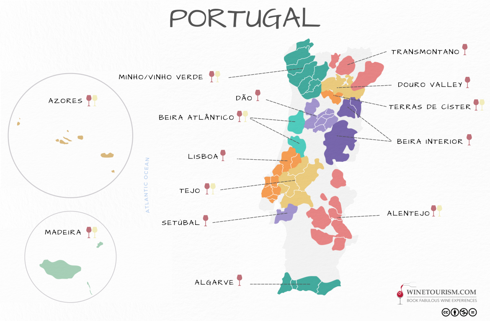

# Portugal

## TOC

<!-- vim-markdown-toc GFM -->

- [Intro](#intro)
  - [01 Climatic influences](#01-climatic-influences)
  - [02 Quality Structure](#02-quality-structure)
  - [03 Location of Districts](#03-location-of-districts)
  - [04 Principal Grape Varietals](#04-principal-grape-varietals)
  - [05 Wines and Production](#05-wines-and-production)
    - [Wines and Production in Dao](#wines-and-production-in-dao)
    - [Wines and Production in Minho](#wines-and-production-in-minho)
    - [Wines and Production in Douro](#wines-and-production-in-douro)
    - [Wines and Production in Bairrada](#wines-and-production-in-bairrada)
    - [Wines and Production in Alentejo](#wines-and-production-in-alentejo)
    - [Wines and Production in Colares](#wines-and-production-in-colares)
    - [Wines and Production in Setúbal](#wines-and-production-in-setúbal)
  - [06 Wine Labelling Terms](#06-wine-labelling-terms)
- [Cert](#cert)
  - [01 Grape Varietals Used to Produce Principal Wines](#01-grape-varietals-used-to-produce-principal-wines)
    - [Douro](#douro)
    - [Bairrada](#bairrada)
    - [Dao](#dao)
    - [Vinho Verde](#vinho-verde)
    - [Setubal](#setubal)
  - [02 Aging Terms and Regime](#02-aging-terms-and-regime)

<!-- vim-markdown-toc -->

## Intro

### 01 Climatic influences

- Maritime climate on the coast thanks to Atlantic Ocean
- Inland vineyards are hot, dry, continental
- altitude is used to mitigate heat

Sources:

- WSET level 3 Portugal, p. 139

### 02 Quality Structure

- no GI: Vinho
- PGI: Indicação Geográfica Protegida (IGP) / Vinho Regional
- PDO: Denominação de Origem Protegida (DOP)

### 03 Location of Districts

- Minho
- Transmontano
- Duriense
- Terras de Cister
- Beira Atlântico
- Terras do Dão
- Terras da Biera
- Lisboa
- Tejo
- Península de Setúbal
- Alentejano
- Algarve
- Terras Madeirenses
- Açores

### 04 Principal Grape Varietals

red:

- Baga
- Castelão
- Tempranillo (Aragonez, Tinta Roriz)
- Touriga Franca
- Touriga Nacoinal (Bical Tinto/Mortágua Preto)
- Trincadeira (Tinta Amarela)

white:

- Fernão Pires (Maria Gomes)
- Encruzado
- Arinto
- Antão Vaz
- Alvarinho (Albariño)
- Sercial (Esgana Cão)

Sources:

- <https://www.guildsomm.com/learn/study/w/study-wiki/210/portugal>

### 05 Wines and Production

#### Wines and Production in Dao

- Producer of premium reds
- Touriga Nacional key grape
- best vineyards at 400 - 500m above sea level in granitic soils
- can make red, white, rosado or espumante under Dão DOP
- red grapes:
  - Touriga Nacional, Jaen, Touriga Franca, Alfrocheiro, Aragonez, Bastardo, Rufete, Trincadeira, Tinta Cão
- white grapes:
  - Encruzado, Bical, Cercial
- ageing:
  - garrafeira:
    - as standard but min alc. 11.5
  - reserva:
    - red: 2 years aging
    - white: 6 months
  - nobre:
    - red:
      - min. 15% Touriga Nacional
      - 3 years aging
    - white:
      - min. 15% Encruzado
      - 1 year aging

#### Wines and Production in Minho

- Minho IGP and Vinho Verde IGP
- famous for (classically) using _enforcado_ training
- Vinho Verde DOP:
  - red, white and rosado
  - fresh wine with petillance
  - white petillance comes from CO2 injection
  - red petillance comes from MLF
- varietal Alvarinho (Monçãoe Melgaço)
- grapes:
  - white:
    - Loureiro
    - Trajadura
    - Avesso
    - Pedernã
    - Alvarinho
  - red:
    - Vinhão
    - Espadeiro
    - Borraçalo
    - Alvarelhão

#### Wines and Production in Douro

- first demarcated wine region in portugal
- Douro DOP:
  - table wine:
    - red:
      - key varietals: Touriga Nacional, Touriga Franca, Tinta Roriz, Tinta Cão, Tinta Barroca
    - white:
      - key varietals: Malvasia Fina, Viosinho, Rabigato, Gouveio
    - rosado
  - licoroso (fortified):
    - Moscatel do Douro:
      - Moscatel Galego
  - sparkling
  - late harvest wines (Colheita Tardia)
- Porto DOP:
  - port

#### Wines and Production in Bairrada

- west of Dão, milder, rainer climate
- red, white and rosado
- mostly red
- main red: Baga
- main whites: Maria Gomes, Arinto
- Baga planted in _barros_ (clay)
- whites planted in sandy soil
- red:
  - blend of Baga, Touriga Nacional, Camarate, Castelão, Jaen and ALfrocheiro
- Bairrada Clássico:
  - only indigenous grapes

#### Wines and Production in Alentejo

- Alentejo DOP
- predom. red wine
- red and white wine
- Trincadeira most predom.
- lots of cork trees: _Quercus suber_

#### Wines and Production in Colares

- red or white
- sandy soils
- traditionally vines planted in trenches to protect from salty marine winds
- red: Ramisco
- White: Malvasia
- inland: harder soil _chao rija_, Castelão more planted

#### Wines and Production in Setúbal

- vinhos licoroso
- sweet white:
  - min. 67% Moscatel de Setúbal (Muscat d'Alexandria)
- red fortified:
  - Moscatel Roxo
- 6 months post-ferment/fort maceration on muscat skins
- maturation in large wooden casks for up to 5 years

### 06 Wine Labelling Terms

- Vinhos Regional (VR): equivalent to IGP
- Garrafeira:
  - cellared wine with minimum aging requirements
- reserva:
  - still:
    - alcohol content > 0.5% than the DOP definition
  - sparkling: 12 months on lees
- Colheita Seleccionada:
  - minimum 1% higher alcohol content than DOP definition (like reserva)

## Cert

### 01 Grape Varietals Used to Produce Principal Wines

See [[#05 Wines and Production]] for grape varietals.

#### Douro

#### Bairrada

#### Dao

#### Vinho Verde

#### Setubal

### 02 Aging Terms and Regime

- DOP or IGP can be labelled as _garrafeira_, cellared wine.
- table wine:
  - red:
    - 36 months
    - including 12 months in bottle
  - white, rose:
    - 12 months
    - including 6 months in bottle
- port: 4 years with maximum 8 years additional minimum 15 years in glass.
