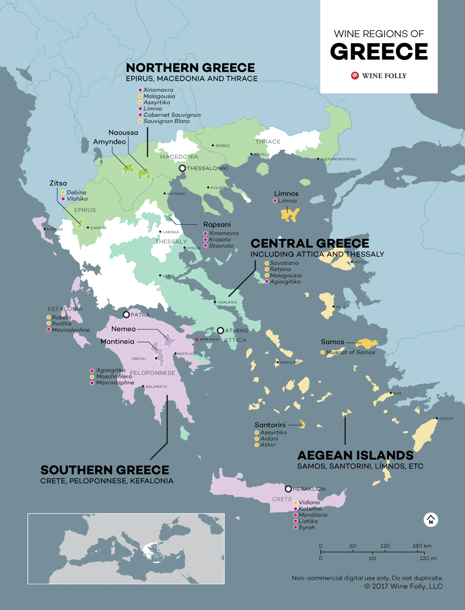

# Greece

## TOC

<!-- vim-markdown-toc GFM -->

- [Intro](#intro)
  - [01 Climatic Influences](#01-climatic-influences)
  - [02 Quality Structure for Quality Wines](#02-quality-structure-for-quality-wines)
  - [03 Principal Regions and Location on Map](#03-principal-regions-and-location-on-map)
  - [04 Grape Varietals](#04-grape-varietals)
  - [05 Principal Wines of Regions](#05-principal-wines-of-regions)
    - [Map](#map)
    - [Naoussa](#naoussa)
    - [Slopes of Meliton](#slopes-of-meliton)
    - [Nemea](#nemea)
    - [Mantinia](#mantinia)
    - [Patras](#patras)
    - [Samos](#samos)
    - [Santorini](#santorini)
  - [06 Labelling Terms](#06-labelling-terms)
- [Cert](#cert)
  - [01 Dessert Wine Production](#01-dessert-wine-production)
    - [1 Samos](#1-samos)
    - [Santorini](#santorini-1)

<!-- vim-markdown-toc -->

## Intro

### 01 Climatic Influences

### 02 Quality Structure for Quality Wines

### 03 Principal Regions and Location on Map

### 04 Grape Varietals

### 05 Principal Wines of Regions

#### Map

#### Naoussa

#### Slopes of Meliton

#### Nemea

#### Mantinia

#### Patras

#### Samos

#### Santorini

### 06 Labelling Terms

## Cert

### 01 Dessert Wine Production

#### 1 Samos

#### Santorini
