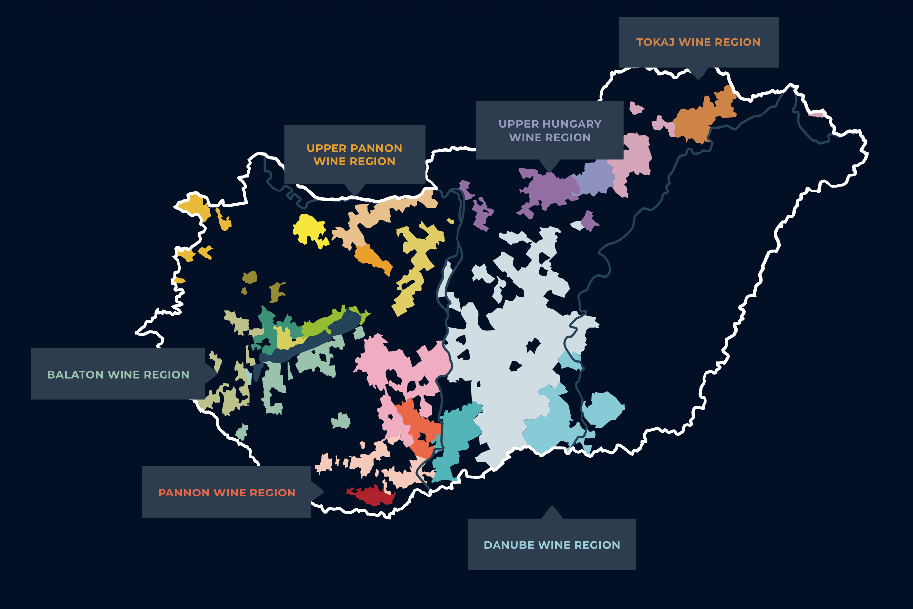
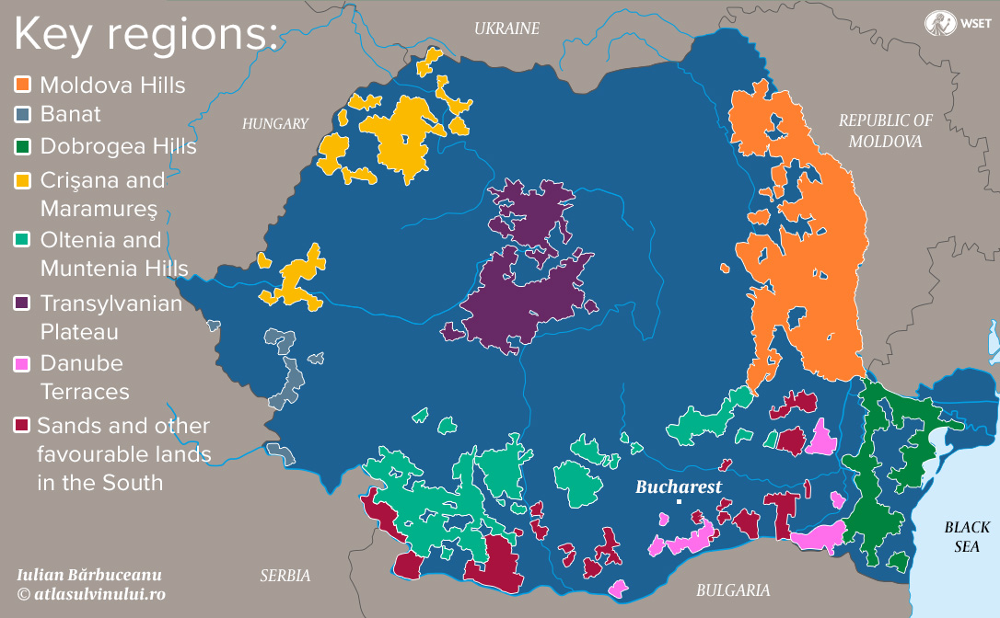

# Europe

## TOC

<!-- vim-markdown-toc GFM -->

- [Intro](#intro)
  - [01 Hungary: Production of Tokaji Wines](#01-hungary-production-of-tokaji-wines)
  - [02 Grape Varietals](#02-grape-varietals)
  - [03 Qualities of Tokaji](#03-qualities-of-tokaji)
- [Cert](#cert)
  - [01 Principal Wine Districts of Bulgaria and Romania](#01-principal-wine-districts-of-bulgaria-and-romania)
    - [Bulgaria](#bulgaria)
    - [Romania](#romania)
  - [02 Eastern European Grape Varietals and Where Grown](#02-eastern-european-grape-varietals-and-where-grown)
    - [Hungary](#hungary)
    - [Bulgaria](#bulgaria-1)
    - [Romania](#romania-1)
    - [Slovenia and Croatia](#slovenia-and-croatia)
    - [Czech Republic and Slovakia](#czech-republic-and-slovakia)
    - [Russia](#russia)
    - [Formr Soviet Republics](#formr-soviet-republics)

<!-- vim-markdown-toc -->

## Intro

### 01 Hungary: Production of Tokaji Wines

- Aszú:
  - predom. Furmint due to suscuptability to botyrtis and high acid
  * botrytised grapes are handpicked and put in puttony
  * free-run juice seperated to make Esszencia
  * Aszú trampled to pastse/dough
  * puttony of mashed aszú mixed with barrels (gönci) of must/base wine
  * number of puttony to gönci determines sweetness
  * age 2 years before release, 18 months in barrel
  * min. 120g/L RS
  * min. ABV 9%
- Esszencia:
  - fermented from free run juice of aszú grapes
  - can take years to complete frementation
  - 4 - 6% ABV
  - min. 450g/L RS
- Szamorodni:
  - mix of aszú and non-aszú
  - oxidative in style
  - aged in cask for min. 6 months
  - can be aged under flor
  - can be édes (sweet) or száras (dry>)
- Fordítas:
  - refermented with pressed paste from Tokaji Aszú
- Máslás:
  - referemented with lees from Tokaji Aszú
- late harvest:
  - no min. aging req.
- dry:
  - made from non-aszú grapes

### 02 Grape Varietals

- Furmint
- Kékfrankos: Blaufränkisch
- Kékoportó: Blaurer Portugieser

### 03 Qualities of Tokaji

- Tokaji Aszú
- Esszencia
- Szamorodni
- Fortítas
- Máslás
- late harvest
- dry

## Cert

### 01 Principal Wine Districts of Bulgaria and Romania

#### Bulgaria

1. Danubian Plain
2. Black Sea coat
3. Thracian Plain
4. Valley of the Roses
5. Struma River Valley

#### Romania

- Moldovan Hills
- Muntenia-Oltenia
- Banat
- Crişana-Maramureş
- Dobrogea
- Danube Terraces
- Transylvanian Plateau
- Sands
- Jidvei DOC
- Târnave DOC
- Cotnari DOC (Moldavia): sweet wines
- Dealu Mare DOC (Muntenia-Oltenia): late harvest Ch
- Murfatlar DOC (Dobrogea): PN, CS

### 02 Eastern European Grape Varietals and Where Grown

#### Hungary

TODO: reformat the tree to have the variety first and regions as a list
TODO: use compendium to finish.

- white:
  - Furmint
- red:
  - Eger:
    - Kékfrankos
  - Mátra:
    - Kékfrankos
    - Kadarka
      Transbudia:
    -
  * Villány:
    - Kékfrankos: Blaufränkisch
    - Kékoportó: Blaurer Portugieser

#### Bulgaria

red:

- Cabernet Sauvignon
- Merlot
- principal-wine-districts-of-bulgaria-and-romaniaGamza
- Mavrud
- Rubin

white:

- Red Misket
- Rkatsiteli
- Dimiat

#### Romania

- white:
  - Fetească Albă
  - Fetească Regală
  - Riseling Italico (Welschriesling)
  - Chardonnay
  - Sauvignon
  - Muscat Ottonel
  - Pinot Gris
- red:
  - Fetească Neagră
  - Burgund Mare
  - Băbească Neagră
  - Rosioara (Pamid)

#### Slovenia and Croatia

- Refosk (Refosco)
- Rebula (Ribolla)
- Sivi Pinot (Pinot Grigio)
- CS
- Merlot
- Pinela
- Zelen
- Crljenak (Zinfandel)

#### Czech Republic and Slovakia

- Müller-Thurgau
- Frankovka (Blaufränkisch)
- Svatovavnnecké (St. Laurent)
- Ryzlink Vlassky (Welschriesling)
- Chardonnay
- Cabernet Sauvignon

#### Russia

- Rkatsieli
- Pinot Noir
- Chardonnay
- Sauvignon Blanc
- Riesling

#### Formr Soviet Republics

- Ukraine:
  - Suavignon Blanc
  - Riesling
  - Welschriesling
  - Furmint
  - Isabella
- Georgia:
  - Saperavi
  - Rkatsiteli
- Armenia:
  - Areni Noir
- Moldova:
  - Fetească Albă
  - Fetească Regală
  - Fetească Neagră
- Bosnia and Herzegovina:
  - Blatina
- Montenegro:
  - Vranec
  - Kratosija (Zinfandel)
