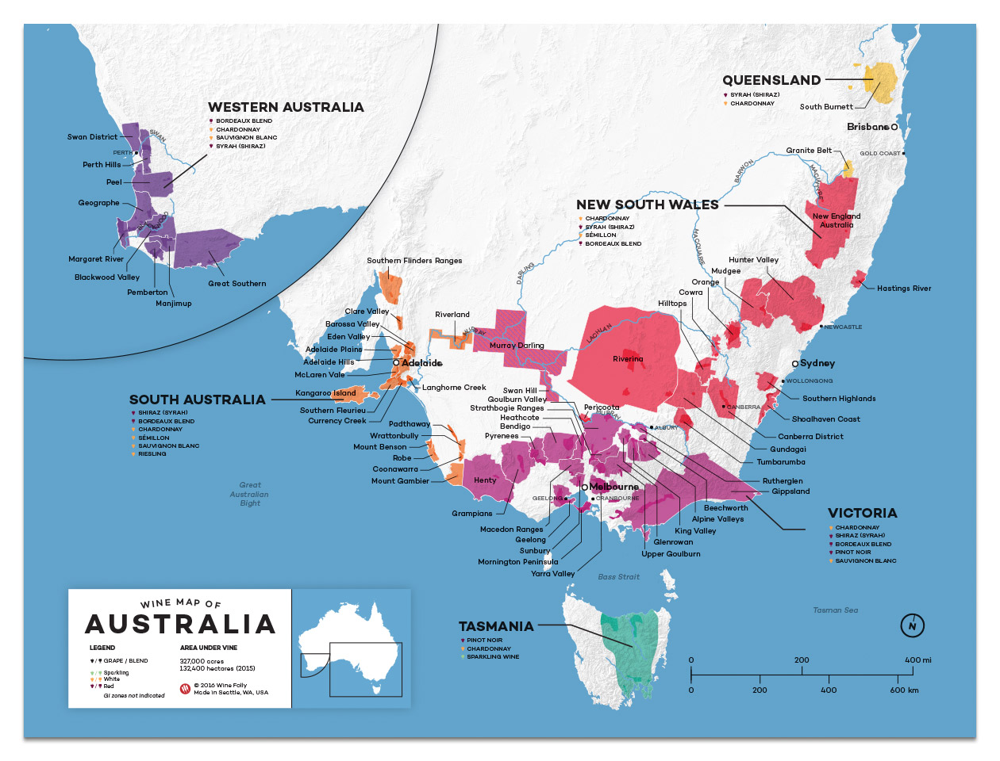

# Australia

## TOC

<!-- vim-markdown-toc GFM -->

- [Intro](#intro)
  - [01 Climatic Influences](#01-climatic-influences)
  - [02 Wine Producing States and Production Regions](#02-wine-producing-states-and-production-regions)
  - [03 Quality Framework and Categories](#03-quality-framework-and-categories)
  - [04 Grape Varietals Associated with Particular Regions of Production](#04-grape-varietals-associated-with-particular-regions-of-production)
  - [05 Wine Zones, Regions](#05-wine-zones-regions)
  - [SE Australia Super Zone](#se-australia-super-zone)
- [Cert](#cert)
  - [01 Zones](#01-zones)
  - [02 Regions](#02-regions)
  - [Principal Producers/Wines by Region](#principal-producerswines-by-region)

<!-- vim-markdown-toc -->

[wine australia GIS Dashboard](https://experience.arcgis.com/experience/)

## Intro

### 01 Climatic Influences

- NSW:
  - great dividing range: seperates wetter coastal areas from arid interior
  - hunter valley:
    - subtropical
    - one of the warmest climates
- Queensland:
- South Australia:
- Tasmania:
- Victoria:
  - coolest state on Australian mainland
  - cooled by sea breezes from Antarctica
  - Port Philip zone: cool maritime climate
  - Geelong: relatively warmer
  - Gippsland zone: coastal
- Western Australia:

### 02 Wine Producing States and Production Regions

- NSW:
  - Riverina (Murrumbidgee Irrigation Area)
  - Hunter Region:
    - one of Australia's most important GI's
  - Canberra District
  - Tumbarumba GI
- Queensland:
  - Granite Belt
  - South Burnett
  - Darling Downs
- South Australia:
  - Limestone Coast:
    - Coonawarra
    - Padthaway
    - Wrattonbully
    - Robe
    - Mount Benson
  - Lower Murray:
    - Riverland GI
  - Fleurieu:
    - Langhorne Creek GI
    - Mclaren Vale GI
  - Barossa:
    - Barossa Valley GI
    - Eden Valley GI
  - Mount Lofty Ranges:
    - Adelaide Hills:
      - Lenswood
      - Piccadilly Valley
    - Adelaide Plains
    - Clare Valley:
      - Water Vale
      - Polish Hill River
- Tasmania
- Victoria:
  - coastal Victoria:
    - Port Philip
    - Mornington Peninsula
    - Gippsland
    - Yarra Valley
  - inland:
    - North West Victoria:
      - Murray Darling
      - Swan Hill
    - Central Victoria:
      - Bendigo
      - Healthcote
      - Goulburn Valley:
        - Nagambie Lakes
    - North East Victoria:
      - Rutherglen
      - Glenrowan
- Western Australia:
  - Margaret River
  - Great Southern:
    - Mount Barker
    - Frankland River
    - Albany
    - Porongurup
    - Denmark
  - Swan Valley

### 03 Quality Framework and Categories

- label integrity program
- labels with variety, vintage or region must contain 85% of the stated
- if multiple varieties listed on the label they must be listed in proportion of blend
- all components making up at least 85% must be on the label
- no listed variety can be in lower proportion than an unlisted variety
- regions are defined by Geographical Indications (GI)
- focus entirely on geographical provenence
- no restriction on yield, grape varieties
- states are divided into:
  - zones
  - regions
  - subregions
- regions can cross zones
- zones can cross states

### 04 Grape Varietals Associated with Particular Regions of Production

- NSW:
  - Riverina:
    - Botrytised Semillon
  - Hunter Valley:
    - Semillon
    - Verdehlo
    - Shiraz
    - Cabernet
  - Canberra District:
    - shiraz
    - shiraz/viognier
  - Tumbarumba GI:
    - sparkling PN/Ch.
- Queensland:
  - Granite Belt:
    - Shiraz
    - Sem.
- South Australia:
  - Limestone Coast zone:
    - Coonawarra:
      - Cabernet Sauvignon
    - Padthaway:
      - Riesling
      - PG
      - Ch.
  - Fleurieu zone:
    - Mclaren Vale GI:
      - Cabernet Sauvignon
      - Shiraz
      - Grenache
      - Mataro
  - Mount Lofty Ranges:
    - Adelaide Hills:
      - SB
      - Ch.
      - PN
    - Clare Valley:
      - Riesling
  - Barossa zone:
    - shiraz
- Tasmania:
  - general:
    - Ch.
    - Riesling
    - PN
  - Tamar Valley:
    - CS
  - Coal River:
    - CS
- Victoria:
  - Port Philip Zone:
    - Yarra Valley GI:
      - PN
      - CS
      - Ch.
      - Shz
      - Shz/Vio
    - Mornington Peninsula GI:
      - PN
      - PG
      - Ch.
    - North West Victoria Zone:
      - Chardonnay
      - Shiraz
    - Central Victoria Zone:
      - Shiraz
      - Marsanne
    - North East Victoria zone:
      - Rutherglen and Glenrowan:
        - Muscadelle (Topaque)
        - Muscat à Petits Grains Rouge (Brown Muscat)
- Western Australia:
  - Margaret River:
    - Ch.
    - Sem.
    - SB
    - CS
  - Great Southern:
    - Mount Barker:
      - Ri.
      - shz
      - CS

### 05 Wine Zones, Regions

- NSW:
  - Big Rivers zone:
    - Murray Darling GI
    - Perricoota GI
    - Riverina GI
    - Swan Hill GI
  - Central Ranges zone:
    - Cowra GI
    - Mudgee GI
    - Orange GI
  - Hunter Valley zone:
    - Hunter GI
  - Northern Rivers zone:
    - Hastings River GI
  - Northern Slopes zone:
    - New England Australia GI
  - South Coast zone:
    - Shoalhaven Coast GI
    - Southern Highlands GI
  - Southern New South Wales zone:
    - Canberra District GI
    - Gundagai GI
    - Hilltops GI
    - Tumbarumba GI
- Queensland:
  - Granite Belt GI
  - South Burnett GI
- South Australia:
  - Barossa zone:
    - Barossa Valley GI
    - Eden Valley GI
  - Far North zone:
    - Southern Flinders Ranges GI
  - Fleurieu zone:
    - Currency Creek GI
    - Kangaroo Island GI
    - Langhorne Creek Gi
  - Limestone Coast zone:
    - Coonawarra GI
    - Mount Benson GI
    - Mount Gambier GI
    - Padthaway GI
    - Robe GI
    - Wrattonbully GI
  - Lower Murray zone:
    - Riverland GI
  - Mount Lofty Ranges zone:
    - Adelaide Hills GI
    - Adelaide Plains GI
    - Clare Valley Gi
- Tasmania
- Victoria:
  - Gippsland zone
  - North West Victoria zone
  - Central Victoria zone:
    - Bendigo GI
    - Goulburn Valley GI
    - Heathcote GI
    - Strathbogie Ranges GI
    - Upper Golburn GI
  - North East Victoria zone:
    - Alpine Valleys GI
    - Beechworth GI
    - Glenrowan GI
    - King Valley GI
    - Rutherglen GI
  - Port Phillip zone:
    - Geelong GI
    - Macedon Ranges GI
    - Mornington Peninsula GI
    - Sunbury GI
    - Yarray Valley GI
  - Western Victoria zone:
    - Grampians GI
    - Henty GI
    - Pyrenees GI
- Western Australia:
  - Greater Perth zone:
    - Peel GI
    - Perth Hills GI
    - Swan District GI
  - South West Australia zone:
    - Blackwood Valley GI
    - Geographe GI
    - Great Southern GI:
      - Albany GI
      - Denmark GI
      - Frankland River GI
      - Mount Barket GI
      - Porongurup GI
    - Manjimup GI
    - Margaret River GI
    - Pemberton GI

### SE Australia Super Zone

- includes all of:
  - Victoria
  - Tasmania
  - NSW
- includes winegrowing areas of:
  - Queensland
  - South Australia
- authorised in 1996
- permits blending across all the described areas

## Cert

### 01 Zones

See [05 Wine Zones, Regions](#05-wine-zones-regions)

### 02 Regions

See [05 Wine Zones, Regions](#05-wine-zones-regions)

### Principal Producers/Wines by Region

- NSW:
  - Riverina:
    - Casella (Yellow Tail)
    - De Bortoli:
      - Noble One:
        - botrytised Semillon
  - Hunter Valley:
    - Tyrrell's:
      - Vat 1:
        - Semillon
  - Canberra District:
    - Clonakilla:
      - Canberra District Shiraz:
        - Shiraz/Viognier
- Queensland:
- South Australia:
  - Coonawarra:
    - Majella
    - Wynn's:
      - John Riddoch
    - Parker Estate:
      - First Growth
  * Mclaren Vale:
    - D'Arenberg:
      - Dead Arm:
        - Shiraz
    - Yangarra:
      - High Sands:
        - Grenache
    - Drew Noon:
      - Eclipse:
        - Grenache
    - Clarendon Hills:
      - Australis:
        - shiraz
  - Barossa Valley:
    - Torbreck:
      - Shiraz
    - Peter Lehmann:
      - shiraz
    - Rockford:
      - TODO:
    - Penfolds:
      - Grange
  - Eden Valley:
    - Yalumba:
      - TODO:
    - Pewsey Vale:
      - TODO:
    - Henschke:
      - Hill of Grace:
        - TODO:
      - Mount Edelstone Shiraz:
        - TODO:
- Tasmania:
- Victoria:
  - Yarra Valley:
    - Mount Mary:
      - TODO:
  - Goulburn Valley:
    - Tahbilk:
      - TODO:
  - Rutherglen:
    - TODO:
- Western Australia:
  - Margaret River:
    - Cullen:
      - TODO:
  * Vasse Felix:
    - TODO:
  * Leeuwin Estate:
    - TODO:
  * Cape Mentelle:
    - TODO:
