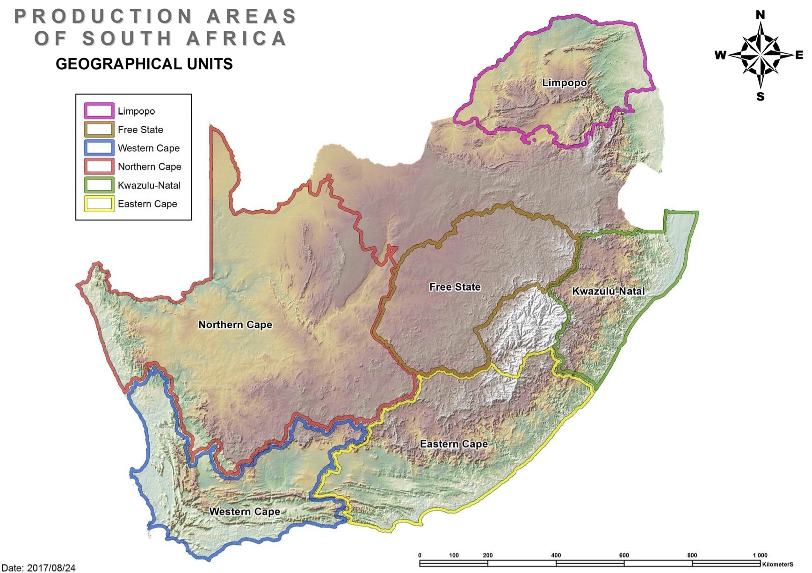
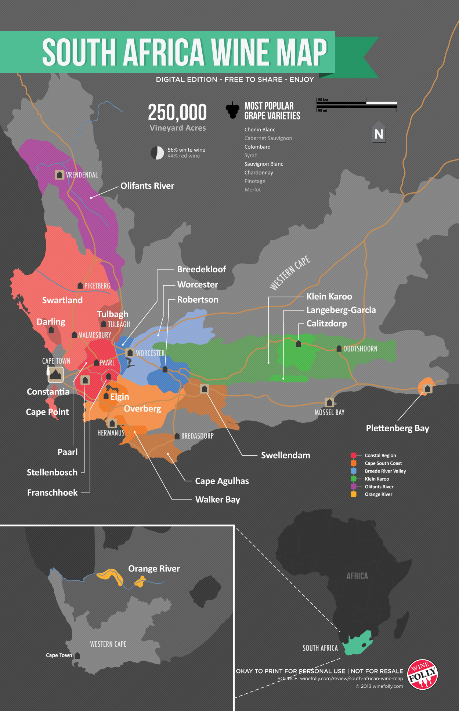
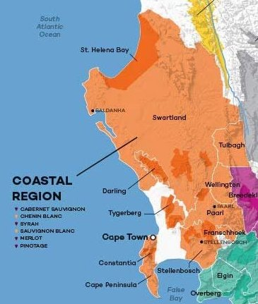

# South Africa

GU of South Africa

## TOC

<!-- vim-markdown-toc GFM -->

- [Intro](#intro)
  - [01 Climatic Influences: Oceans and Mountain Ranges](#01-climatic-influences-oceans-and-mountain-ranges)
  - [02 Wine law and Labelling Regulations (WO)](#02-wine-law-and-labelling-regulations-wo)
  - [03 Climate and Soils](#03-climate-and-soils)
    - [Climate](#climate)
    - [Soils](#soils)
  - [04 Structure of Wine Production](#04-structure-of-wine-production)
  - [05 Geographical Units: Regions, Districts, Wards & Estates](#05-geographical-units-regions-districts-wards--estates)
    - [Structure of Western Cape](#structure-of-western-cape)
  - [06 Principal Wine Regions of the Western Cape](#06-principal-wine-regions-of-the-western-cape)
    - [Stellenbosch](#stellenbosch)
    - [Franschoek](#franschoek)
    - [Paarl](#paarl)
    - [Constantia](#constantia)
- [- high quality dessert wine, SB, Bordeaux Blends](#--high-quality-dessert-wine-sb-bordeaux-blends)
  - [Walker Bay](#walker-bay)
  - [Elgin](#elgin)
  - [07 Varietals Associated with Production Areas](#07-varietals-associated-with-production-areas)
- [Cert](#cert)
  - [01 Districts Within Major Wine Regions](#01-districts-within-major-wine-regions)
    - [Coastal](#coastal)
    - [Breede River](#breede-river)
  - [02 Labeling Terms such as Cape Classique, Cape Blend](#02-labeling-terms-such-as-cape-classique-cape-blend)

<!-- vim-markdown-toc -->

## Intro

### 01 Climatic Influences: Oceans and Mountain Ranges

Oceans:

- Benguela Current:
  - runs from Antarctica north
  - cools coastal areas
- Cape Doctor:
  - strong southeasterly wind
  - moderates temperatures
  - inhibits fungal disease
  - can damage vines

Mountain Ranges:

- mountain ranges rim the coastline
- mountains segment SA into climatic zones
- coastal side cool and rainy
- inland hot and dry
- temperate valleys in between mountains and inland
- vineyard elevation ranges from 50 - 600 meters

### 02 Wine law and Labelling Regulations (WO)

- Wine of Origin (WO)
- introduced 1973
- to get certification must submit sample to tasting panel
- panel confirms organoleptic(?) qualities of cultivar and stated age
- backed up with scientific analysis
- requirements:
  - fruit:
    - must used approved cultivars
    - mono-varietal wine:
      - must contain 85% of stated grape
    - blends:
      - vinification of cultivars seperate prior to blending
      - each grape minimum 20% of wine
  - vintage:
    - 85% of stated vintage required
  - GI:
    - all fruit must originate from stated GI

Sources:

- [Guildsomm: South Africa (Intro)](https://www.guildsomm.com/learn/study/w/study-wiki/207/south-africa#01)

### 03 Climate and Soils

#### Climate

- Atlantic and Indian Oceans
- Overall Mediterranean climate
- long dry summer
- rain in winter

#### Soils

- simple soil
- old soil
- mountains made of granite cappedwith sandstone
- Most soil in SA is decomposed granite and sandstone
- Quartz scattered throughout vineyard area

### 04 Structure of Wine Production

?

### 05 Geographical Units: Regions, Districts, Wards & Estates

- part of WO system
- 4 types of production area, in descending size:
  - Geographical Unit
  - Region
  - District
  - Ward
- single-vineyard:
  - vineyard needs to be registered
  - all fruit comes from the vineyard
  - vineyard smaller than 6 hectares (60km$^2$)
- Estate:

  - requirements:
    - estate vineyards are contiguous
    - bottled on single property

#### Structure of Western Cape

- GU:

  - Region:
    - District:
      - Ward

NOTE: Missing wardsafter Stellenbosch

- Western Cape GU:
  - Breede River Valley Region:
  - Breeekloof District
  - Robertson District
  - Worcester District
  - Cape South Coast Region:
  - Cape Agulhas
  - Elgin
  - Lower Duivenhoks River
  - Overberg
  - Plettenberg Bay
  - Swellendam
  - Walker Bay
  - Coastal Region:
  - Cape Town District:
    - Constantia Ward
    - Durbanville Ward
    - Hout Bay Ward
    - Philadelphia Ward
  - Darling District:
    - Groenekloof Ward
  - Franschhoek Valley District:
  - Lutzville Valley District:
    - Koekenkaap
  - Paarl District:
    - Agter-Paarl Ward
    - Simonsberg-Paarl Ward
    - Voor-Paardeberg Ward
  - Stellenbosch District:
    - Banghoek Ward
    - Bottelary Ward
    - Devon Valley Ward
    - Jonkershoek Valley Ward
    - Papegaaiberg Ward
    - Polkadraai Hills
    - Simonsberg-Stellenbosch
    - Vlottenburg
  - Swartland District
  - Tulbagh District
  - Wellington District
  - Klein Karoo Region
  - Olifants River Region

Sources:

- [Guildsomm: South Africa (Intro)](https://www.guildsomm.com/learn/study/w/study-wiki/207/south-africa#01)

### 06 Principal Wine Regions of the Western Cape

Map of South Africas Wine Regions

#### Stellenbosch

- District: Stellenbosch
- Region: Coastal Region
- Major Grapes:
  - white:
    - SB
    - CB
    - Ch.
    - Sém.
  - red:
    - CS
    - Shz
    - Merlot
    - Pinotage
    - CF
- wines:

  - still:
    - red
    - white
  - sparkling
  - dessert
  - fortified

- high quality red wines
- soils:
  - valley floor: alluvial loam over shale
  - hillside: decomposed granite and sandstone
- climate:
  - maritime
  - warmer than Bordeaux
- famous for red Bordeaux blends

Sources:

- [Compendium: Stellenbosch](https://www.guildsomm.com/research/compendium/w/safrica/930/stellenbosch)
- [Guildsomm: South Africa (Intro)](https://www.guildsomm.com/learn/study/w/study-wiki/207/south-africa#01)

#### Franschoek

Means _French Quarter_.

- District: Franschhoek Valley
- Region: Coastal Region
- Major grapes:
  - white:
    - old vine Semillon
    - SB
    - Ch.
    - CB
  - red:
    - CS
    - Mer.
    - Shz
    - Pinotage
- Style:
  - still red
  - still white
  - Sparkling
  - Dessert
  - Fortified
- Major natural features:

  - Franschhoek
  - Drakenstein
  - Wemmershoek Mountains
  - Berg River

#### Paarl

- District: Paarl
- region: Coastal Region
- major grapes:
  - white:
    - CB
    - Ch.
    - SB
  - red:
    - CS
    - Shz
    - Pinotage
    - Mer.
- styles:
  - still:
    - red
    - white
  - sparkling
  - fortified
  - botrytis-affected dessert wines
- soil:

  - sandstone
  - granite
  - weathered shale

- means "pearl"
- warmer, inland location
- quality still red and whites

Sources:

- [Compendium: Paarl](https://www.guildsomm.com/research/compendium/w/safrica/919/paarl)
- [Guildsomm: South Africa (Intro)](https://www.guildsomm.com/learn/study/w/study-wiki/207/south-africa#01)

#### Constantia

- region: Coastal Region
- district: Cape Town
- WO level: ward
- famous for Constantia Vineyard
- established on Constantiaberg
- decomposed granite slopes
- famous for dessert wine Vin de Constance
- climate:
  - mountain provides shade to vineyards
  - climate moderated by cool sea breezes from False Bay
  - long growing season
- high quality dessert wine, SB, Bordeaux Blends
-

- [Guildsomm: South Africa (Intro)](https://www.guildsomm.com/learn/study/w/study-wiki/207/south-africa#01)
- [Winesearcher - Constantia Wine](https://www.wine-searcher.com/regions-constantia)

#### Walker Bay

- WO level: District
- Region: Cape South Coast
- Nearby city: Hermanus
- major grapes:
  - white:
    - Ch.
    - CB
    - Sém.
  - red:
    - PN
    - Shz
    - Pinotage
    - Mourvèdre
- soils:
  - shale, granite, sandstone
- Natural features:

  - Atlantic Ocean/Walker Bay
  - Bot River

- high quality Ch, PN, Pinotage
- cool climate

Sources:

- [Compendium: Walker Bay](https://www.guildsomm.com/research/compendium/w/safrica/934/walker-bay)
- [Guildsomm: South Africa (Intro)](https://www.guildsomm.com/learn/study/w/study-wiki/207/south-africa#01)

#### Elgin

- WO level: District
- Region: Cape South Coast
- major grapes:
  - white:
    - SB
    - Ch.
    - Ries.
  - red:
    - PN
    - Merlot
- soil:
  - shale
  - sandstone
- natural features:

  - Hottentots-Holland Mountains
  - Atlantic Ocean

- Coolest growing climate in SA
- located SE of Stellenbosch
- lots of rain
- regular cloud cover extends ripening
- frost is a concern
- Ch., SB dominate
- Notable Pinot Noir

- [Compendium: Elgin](https://www.guildsomm.com/research/compendium/w/safrica/1212/elgin)
- [Guildsomm: South Africa (Intro)](https://www.guildsomm.com/learn/study/w/study-wiki/207/south-africa#01)
- [Guildsomm: SOuth Africa (Expert)](https://www.guildsomm.com/research/expert_guides/w/expert-guides/2430/south-africa)

### 07 Varietals Associated with Production Areas

SA general:

- white:
  - Steen (CB)
  - Ch.
  - SB
  - Hanepoot (Muscat of Alexandria)
  - Colombard
  - Muscat Blanc à Petit Grains
  - Semillon
- red:
  - Pinotage (crossing of Cinsault and PN)
  - CS
  - Syr.
  - Cinsault
  - PN
  - Merlot

See [06 Principal Wine Regions of the Western Cape](#06-principal-wine-regions-of-the-western-cape) for the varietals of each _Production Area_.

## Cert

### 01 Districts Within Major Wine Regions

#### Coastal

Districts:

- Cape Town
- Darling
- Franschhoek Valley
- Lutzville Valley
- Paarl
- Stellenbosch
- Swartland
- Tulbagh
- Wellington

Sources:

- [Compendium: Coastal Region](https://www.guildsomm.com/research/compendium/w/safrica/918/coastal-region)

#### Breede River

- Breedekloof District
- Robertson District
- Worcester District

Sources:

- [Compendium: Breede River Valley]

### 02 Labeling Terms such as Cape Classique, Cape Blend

- Cape Classique:
  - traditional method sparkling wine
  - Méthode Cap Classique (MCC)
  - PN/Ch.
  - rest on lees at least 12 months
- Cape Blend:
  - Equivalent to Bordeaux blend
  - originates in Stellenbosch
  - Pinotage and one ore more of:
    - Merlot
    * Cabernet Sauvignon
    * Syrah

Sources:

- <https://www.wineanorak.com/cape_blends.htm>
- <https://capreo.com/en/wine-glossary-Cape-Blend>
- [Guildsomm: South Africa (Intro)](https://www.guildsomm.com/learn/study/w/study-wiki/207/south-africa#01)
