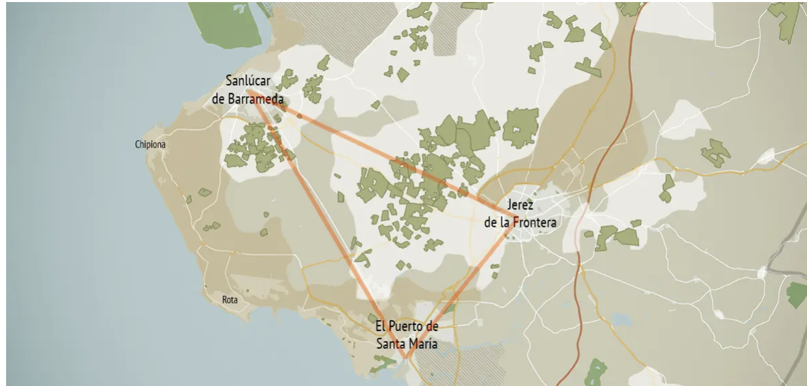
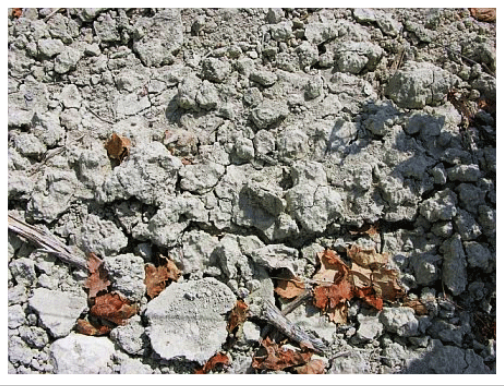

# Fortified Wines

## TOC

<!-- vim-markdown-toc GFM -->

- [Intro](#intro)
  - [Sherry](#sherry)
    - [Location of Sherry Production](#location-of-sherry-production)
    - [Soils of Sherry Wine](#soils-of-sherry-wine)
    - [Varietals of Sherry](#varietals-of-sherry)
    - [Sherry Production Methods](#sherry-production-methods)
    - [Sherry Wine Types](#sherry-wine-types)
    - [Non-Fortified Sherry](#non-fortified-sherry)
  - [Port (intro)](#port-intro)
    - [Douro Region and Production Centers](#douro-region-and-production-centers)
    - [Soils of Port](#soils-of-port)
    - [Permitted Varietals of Port](#permitted-varietals-of-port)
    - [Port Production Methods](#port-production-methods)
    - [Port Types: Ageing and Qualities](#port-types-ageing-and-qualities)
  - [Madeira](#madeira)
    - [Topography and Climate of Madeira](#topography-and-climate-of-madeira)
    - [Soils of Madeira](#soils-of-madeira)
    - [Permitted Varietals of Madeira](#permitted-varietals-of-madeira)
    - [Madeira Production Methods](#madeira-production-methods)
    - [Madeira Styles](#madeira-styles)
- [Cert](#cert)
  - [Sherry: VOS and VORS Designations](#sherry-vos-and-vors-designations)
  - [Port](#port)
    - [Sub Districts](#sub-districts)
    - [Recent Port Vintages](#recent-port-vintages)
  - [Madeira Ageing and Designations](#madeira-ageing-and-designations)

<!-- vim-markdown-toc -->

## Intro

### Sherry

#### Location of Sherry Production

- Jerez Superior:
  - between Sanlúcar de Barrameda andthe Guadalete River
  - Subregion of Jerez
  - 80% of the vines of the appellatoin
- towns:
  - Jerez de la Frontera:
    - most vineyards here
    - vineyards include:
      - Macharnudo
      - Añina
      - Carrascal
  - El Puerto de Santa María
  - Sanlúcar de Barrameda
- DO:
  - 2 DO:
    - Jerez-Xérès-Sherry
    - Manzanilla-Sanlúcar de Barrameda:
      - must be aged in Sanlúcar de Barrameda
      - seaside town
      - much cooler than Jerez de la Frontera
  - same geographical locations, diff. aging requirements.

#### Soils of Sherry Wine

- albariza:
  - porous
  - limestone rich
  - white color
  - best sherry
  - moisture retentive
  - found in Jerez Superior
- barros:
  - fertile
  - difficult to work
  - higher prop. of clay
  - predom. in low-lying valleys
- arenas:
  - sandy
  - most common in costal areas

#### Varietals of Sherry

- Palomino:
  - also known as Listán
  - only varietal allowed for production of Manzanilla
  - neutral grape
  - producews low-acid. lackluster wines
  - by far the most preferred grape for sherry with 95% of vineyard acerage
  - sub-varieties:
    - Palomino Fino:
      - more common
      - disease restistant
    - Palomino de Jerez
- Pedo Ximénez:
  - used to sweeten sherry alongside Moscatel
  - can be imported from Montilla-Moriles DO as plantings in Jerez are rare
  - _soleo_ used to prepare grapes before pressing
- Moscatel:
  - used to sweeten sherry alongside PX
  - mostly cultivated in arenas near Chipiona
  - commonly known as Muscat de Alexandria

#### Sherry Production Methods

- press
- must (mosto de yema) division:
  - primera yema (free run)
  - segunda yema
  - mosto prensa: used for distillation
- pre-primary fermentation preparation:
  - acidification:
    - palomino naturally low acid
    - acidification:
      - tartaric acid addition
  - sulfurification
  - clarificationn via racking (desfangado)
- primary fermentation:
  - divided into 2 stages:
    - hot, vigorous fermentation lasting a week
    - lenta: slow feremnt, gentle conversion of remaining sugar to alcohol
  - final result: 11 - 12.5% ABV
  - traditionally in american oak, today in stainless steel
- post-primary fermentation processing:
  - racking off of lees
- first classification and division:
  - palo:
    - marked with a vertical slash
    - destined to be Fino or Manzanilla
    - _primera yema_
  - gordura:
    - marked with a circle
    - destined to be Oloroso
    - _segunda yema_
- fortification:
  - palo:
    - 15 - 15.5%
    - lower fortification enables growth of flor
  - gordura:
    - 17 - 18%
    - higher fortification prevents growth of flor
  - fortificaton done with mitad y mitad
- aging:
  - old sherry butts made from american oak
  - biological aging:
    - palo
    - occurs under flor
    - grapes grown in albariza soil are preferred for biological aging
  - oxidative aging:
    - gordura
- sobretablas and second classification:
  - 600L american oak butts
  - maturing biological aged palo is monitored
  - monitoring:
    - observing health of flor and character of developing wine
  - path of aging can be redirected during this time interval to create different styles depending on the health of the flor and quality of the wine
  - 6 months to a year
  - classification of quality of biological aging
  - categories:
    - Palma:
      - flor has flourished
      - destined for Fino
    - Palma Cortada:
      - robust Fino
      - may end as Amontillado
    - Palo Cortado:
      - rare wine
      - Flor has flourished but wine richness indicates that it is suitable for oxidative aging
      - will be fortified after sobretablas
      - fortification to 17% to kill the flor
    - Raya:
      - flor is not performing well or dead
      - fortified to 17 - 18% to create Oloroso
    - Dos Rayas:
      - flor is dead
      - character rough and coarse
      - high levels of VA
      - destiny:
        - blended and sweetened for lower quality sherry
        - sherry vinegar
  - solera aging:
    - consists of tiers of butts with successively more matured sherry
    - the tiers are known as criadera
    - new vintage enters top-most criadera
    - several criadera seperate young wine from the solera
    - the last criadera is called the _solera_
    - wine for bottling drawn from the solera
    - min. 3 criadera, max 14
    - for every liter taken from solera, 2 must remain
    - movement of wine through the tiers is called _trasiegos_
    - a solera system-specific character develops as the majority liquid is always the matured volume
  - biological aging:
    - añada replenishes nutrients in solera
    - trasiegos adds more oxygen
  - can be used for oxidative and biological aging
- cabeceo:
  - blending and sweetening of sherry
  - done on small scale then proportions applied to larger batch
  - minimum 17.5% ABV
  - sweetening agents:
    - dulce pasa:
      - mistela made from sunned Palomino
      - most common sweetening agent
    - dulce de almíbar:
      - mix of invert sugar and Fino
      - common in Jerez
    - mistela:
      - from sunned Moscatel or Pedro Ximénez
      - PX preferred but expensive
    - vino de color:
      - mix of boiled, reduced syrup and fresh must
      - reduction levels:
        - 1/3 reduction: sancocho
        - 1/5 reduction: arrope

terms:

- _soleo_:
  - bunches are dried on esparto gras mats before pressing.
  - typcially used for PX and Moscatel when used as sweetening agents
- mitad y mitad:
  - mix of grape spirit and mature sherry
  - lower ABV fortification to not _shock_ the base wine
- flor del vino:
  - specialised subset of Saccharomyces
  - metabolises glycerin, alcohol and volatile acids
  - requires:
    - humid air
    - mderate temperature
    - _lack_ of fermentable sugars
    - 15 - 15% ABV
    - oxygen
  - film:
    - because it needs oxygen it ends up forming a film to provide contact between itself and the nutrient-filled liquid and the atmosphere
    - film protects the wine from oxidation
  - growth periods:
    - happier in spring and autumn: foamy and white
    - limpid in summer and winter: thin and grey
- añada: vintage
- solera is from latin _solum_ for floor

#### Sherry Wine Types

- Generoso:
  - dry sherries
  - styles:
    - Fino:
      - light, delicate, almond toned
      - high concentration of acetaldehydes
      - salty tang
      - 15- 17% ABV
    - Fino-Amontillado:
      - Fino that lost its flor
      - begins to age oxidatively
      - can become Amontillado
    - Amontillado:
      - robust hazelnut character
      - 16 - 22% ABV
    - Oloroso:
      - means _fragrant_
      - spicy, walnut tones
      - smooth mouthfeel
      - 17 - 22% ABV
    - Palo Cortado:
      - rare
      - combines body and color of Oloroso with character of Amontillado
    - Sanlúcar de Barrameda:
      - Manzanilla Fina:
        - like Fino
        - earlier harvest
        - lower in abv
        - fortified less
        - move through solera quicker
      - Manzanilla Pasada:
        - like Fino-Amontillado
      - Manzanilla añada
- Generoso Liqueur:
  - Pale Cream:
    - light, fresh
    - made from Fino
  - Cream:
    - darker, denser
    - made from Oloroso
  - Dry:
    - paler
    - sweet
  - Medium:
    - amber
    - rich
    - can include Amontillado
    - further categories: Golden, Milk, Brown

#### Non-Fortified Sherry

- Vinos de Pasto:
  - low ABV white
  - for local consumption
  - terroir focus
  - can use sherry production methods such as soleo and flor
- sherry base wine with naturally higher ABV (15%):
  - unfortified wines could not use Jerez-Xérès-Sherry DO
  - Jerez-Xérès-Sherry DO updated in 2022 to allow styles without Fortification but require minimum 15% ABV

Sources:

- <https://www.sherrynotes.com/2019/background/towards-unfortified-sherry/>

### Port (intro)

#### Douro Region and Production Centers

- Duriense IGP
- Porto DOP

#### Soils of Port

- Schist is the preferred soil type for Port
- found in Douro Region

#### Permitted Varietals of Port

Red:

- Touriga Nacional
- Touriga Francesa
- Tinta Roriz
- Tinta Cão
- Tinta Barroca
- Tinta Amarela
- Tinta Francisca
- Bastardo
- Mourisco Tinto

white:

- Gouvelo
- Malvasia Fina
- Viosinho
- Rabigato
- Esgana Cão
- Folgasão

#### Port Production Methods

- harvest
- destem:
  - full
  - partial
- crush:
  - traditional:
    - foot crush in open granite trough _lagares_
- primary fermentation:
  - traditional:
    - fermented in _lagares_
  - modern:
    - autovinifiers
    - open-top fermentation with pump over
  - 2 to 3 days
  - maximmise extraction of color and flavor before too much RS lost
  - white and rosé less maceration
- fermentation arrest:
  - stop primary ferment when desired RS reached
  - stop by pressing fermenting wine off solids
- beneficio (foritification/mutage):
  - done when 1/3 sugar converted to alcohol
  - fortifiy to 19 - 22% ABV
  - use aguadente: 77% ABV neutral grape spirit
  - kills yeasts present
  - ratio:
    - typically 1:4 aguadente to wine
    - white port more wine to be lower alcohol.
- maturation:
  - done in a pipe:
    - traditional barrel
    - 550L

#### Port Types: Ageing and Qualities

- Ruby:
  - aging:
    - aged in bulk
    - 2 - 3 years
    - no vintage date
  - qualities:
    - uncomplicated
    - deeply colored
    - inexpensive
- Ruby Reserve Port:
  - more complex than basic port
- Vintage Port:
  - background:
    - declared in exceptional harvests
    - authoriesed by IVDP
  - aging:
    - aged in casks
    - bottled by July 30 of third year after harvest
    - will mature in bottle for decades
  - qualities:
    - young: brash fruit
    - matured: complex attributes
- Single quinta Vintage Port:
  - estate-level vintage port
  - same production methods as vintage port
  - examples include:
    - Warre's Quinta de Cavadinha
    - Taylor's Quinta de Vargellas
    - Dow's Quinta do Bomfim
- Late-Bottled Vintage Port:
  - aging:
    - 4 - 6 years in cask
    - do not improve with bottle age
  - qualities:
    - tawny and ruby qualities
  - production:
    - single vintage
    - filtered before bottling
  - if labelled Envelhecido em Garrafa indicates 3 years bottle age
- Tawny:
  - aging:
    - no cask aging
    - paler wine due to:
      - provenance of grapes
      - lower extraction
      - addition of white port to blend
- Reserve Tawny:
  - aging:
    - 7 years prior to bottling
    - will not develop in bottle
  - production:
    - blend of several vintages
  - qualities:
    - youthful freshness and creamy delicate from maturity
- Tawny with Indication of Age:
  - age statements:
    - levels:
      - 10
      - 20
      - 30
      - 40
      - 50
    - statement:
      - an approximation based on how the wine taste compares to expectation for the age statement
  - production:
    - from high-quality fruit
    - racked once annually
    - blending prior to bottling
  - aging:
    - aged in seasoned wood
  - qualities:
    - as ascend in age more concentrated and developed
    - oxidative, rancio character by 40 years of age
    - 20 years preferred for balance of youthful and rancio character
- Colheita Tawny:
  - vintage dated port
  - aging:
    - 7 years in cask
    - can stay in cask for decades
    - some producers only bottle to order

### Madeira

#### Topography and Climate of Madeira

- topography:
  - Steep inclines
  - terraces (poios)
- climate:
  - suptropical
  - perpetual cloud cover
  - high rainfall

#### Soils of Madeira

- fertile volcanic soils

#### Permitted Varietals of Madeira

- Malvasia (Malmsey)
- Boal
- Verelho
- Sercial

#### Madeira Production Methods

- Harvest:
  - Boal and Malvasia:
    - harvested first
  - Sercial and Verdehlo:
    - harvested last
- fermentation:
  - Boal and Malvasia:
    - short fermentation on skins
  - Sercial and Verdehlo:
    - fermented off skins
- fortification:
  - fortified to arrest fermentation and preserve sugars
  - use a % proof french spirit
- heating:
  - Estufagem:
    - base method:
      - fortified wine plasced in estufa
      - heat to 45 - 50°C
      - hold for min. 3 months
      - sugars caramelize
      - rest (estágio) for 3 months
    - armazens de calor:
      - wine placed in rooms warmed by tanks/steam pipes
      - gentler heating
      - longer time: up to 1 year
  - Canteiro:
    - use attics of lodges
    - warmed by the sun
    - cask aged in the attic for at least 2 years
    - bottled with min. 3 years
    - best lay in cask for 20 years +: Frasqueiras

#### Madeira Styles

- Varietal:
  - Sercial:
    - driest
    - extreme acidity
    - citrus -> almond with age
    - aperitif
  - Verdelho:
    - medium dry
    - high acid
    - smokey, honey character
    - slightly fuller body
  - Boal:
    - medium sweet
    - high acidity
    - highly aromatic: chocolate, roast nut, coffee
    - With age, it is the darkest Madeira

## Cert

### Sherry: VOS and VORS Designations

- Sherry Wines of Certified Age:
  - background:
    - introduced by Consejo Regulador in 2000
    - verified by tasting panel
    - approval based on lot of drawn wine, not entire solera
- VOS:
  - Very Old Sherry/Vinum Optimum Signatum
  - solera wine with an average of 20 years of maturation
  - for every liter of VOS taken from solera, 20 liters must remain
- VORS:
  - Very Old Rare Sherry/Vinum Optimum Rare Signatum
  - solera wine with an average of 30 years of maturation
  - for every liter taken 30 must remain
- solera age certification:
  - Consejo Regulador can certify whole solera
  - either 12 or 15 years
  - can use on label

### Port

#### Sub Districts

- Douro subzones:
  - Baixo Corgo: highest density of plantings
  - Cima Corgo: highest total acerage
  - Douro Superior: most arid and sparsely planted

#### Recent Port Vintages

- 2017
- 2016
- 2011
- 2007
- 2003
- 2000

Sources:

- <https://www.ivdp.pt/pt/vinhos/vinhos-do-porto/vintages/>

### Madeira Ageing and Designations

- Rainwater:
  - maximum age 10 years
- Vinho de Canteiro:
  - 2 years in wood
  - cant be bottled until 36 months after final fortification
- Vinho de Estufagem:
  - min. 12 months after estufagem
- Solera:
  - min. 5 years in solera
