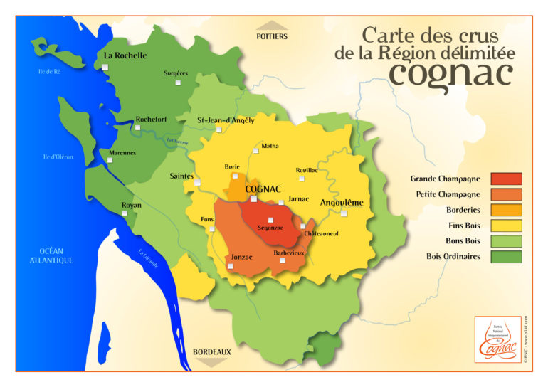

# Spirits

## TOC

<!-- vim-markdown-toc GFM -->

- [Intro](#intro)
  - [01 Principals of Distillation](#01-principals-of-distillation)
  - [02 Methods of Production, Terms Used and Qualities of the Following Products](#02-methods-of-production-terms-used-and-qualities-of-the-following-products)
    - [Scotch Whisky](#scotch-whisky)
      - [Malt Scotch Whisky](#malt-scotch-whisky)
        - [Methods of Production of Malt Scotch](#methods-of-production-of-malt-scotch)
        - [Qualities of Malt Scotch](#qualities-of-malt-scotch)
        - [Terms Used In Prod of Malt Scotch](#terms-used-in-prod-of-malt-scotch)
      - [Blended Scotch](#blended-scotch)
        - [Methods of Production of Blended Scotch](#methods-of-production-of-blended-scotch)
        - [Qualities of Blended Scotch](#qualities-of-blended-scotch)
        - [Terms Used In Prod of Blended Scotch](#terms-used-in-prod-of-blended-scotch)
    - [Irish Whiskey Types and Production](#irish-whiskey-types-and-production)
      - [Methods of Production of Irish Whiskey](#methods-of-production-of-irish-whiskey)
      - [Qualities of Irish Whiskey](#qualities-of-irish-whiskey)
      - [Terms Used In Prod of Irish Whiskey](#terms-used-in-prod-of-irish-whiskey)
    - [US Whiskey Types](#us-whiskey-types)
      - [Methods of Production of US Whiskey](#methods-of-production-of-us-whiskey)
      - [Qualities of US Whiskey](#qualities-of-us-whiskey)
      - [Terms Used In Prod of US Whiskey](#terms-used-in-prod-of-us-whiskey)
    - [Cognac](#cognac)
      - [Methods of Production](#methods-of-production)
      - [Qualities](#qualities)
      - [Terms Used In Prod](#terms-used-in-prod)
      - [Ageing](#ageing)
      - [Examples of Products](#examples-of-products)
    - [Calvados](#calvados)
    - [Tequila](#tequila)
      - [Methods of Production of Tequila](#methods-of-production-of-tequila)
      - [Qualities of Tequila](#qualities-of-tequila)
      - [Terms Used In Prod of Tequila](#terms-used-in-prod-of-tequila)
    - [Gin](#gin)
      - [Methods of Production of Gin](#methods-of-production-of-gin)
      - [Qualities of Gin](#qualities-of-gin)
      - [Terms Used In Prod of Gin](#terms-used-in-prod-of-gin)
    - [Vodka](#vodka)
      - [Methods of Production of Vodka](#methods-of-production-of-vodka)
      - [Qualities of Vodka](#qualities-of-vodka)
      - [Terms Used In Prod of Vodka](#terms-used-in-prod-of-vodka)
    - [Rum](#rum)
      - [Methods of Production of Rum](#methods-of-production-of-rum)
      - [Qualities of Rum](#qualities-of-rum)
      - [Terms Used In Prod of Rum](#terms-used-in-prod-of-rum)
- [Cert](#cert)
  - [01 Identify Specific Spirit Types](#01-identify-specific-spirit-types)
    - [Islay Whisky](#islay-whisky)
    - [Fine Champagne](#fine-champagne)
    - [Armagnac](#armagnac)
      - [Producers](#producers)
      - [Specific Terms](#specific-terms)
      - [Further Reading](#further-reading)
    - [Marc/Grappa](#marcgrappa)
    - [Tequila & Mezcal](#tequila--mezcal)
    - [Eau de Vie (Fruit Spirits)](#eau-de-vie-fruit-spirits)

<!-- vim-markdown-toc -->

## Intro

### 01 Principals of Distillation

TODO:

### 02 Methods of Production, Terms Used and Qualities of the Following Products

TODO:

#### Scotch Whisky

TODO:

##### Malt Scotch Whisky

TODO:

###### Methods of Production of Malt Scotch

###### Qualities of Malt Scotch

###### Terms Used In Prod of Malt Scotch

##### Blended Scotch

TODO:

###### Methods of Production of Blended Scotch

###### Qualities of Blended Scotch

###### Terms Used In Prod of Blended Scotch

#### Irish Whiskey Types and Production

TODO:

##### Methods of Production of Irish Whiskey

##### Qualities of Irish Whiskey

##### Terms Used In Prod of Irish Whiskey

#### US Whiskey Types

TODO:

##### Methods of Production of US Whiskey

##### Qualities of US Whiskey

##### Terms Used In Prod of US Whiskey

#### Cognac

##### Methods of Production

- copper pot stills
- two years in french oak from Limousin or Troncais
- Process:
  - pre-ferment processing:
    - press grapes
  - fermentation:
    - ferment 2 - 3 weeks
    - natural yeast innoculation
    - no chaptalization or sulfur addition
  - distillation:
    - distillation in _Charenatais_ (copper alembic stills)
    - two distillations = 70%
    - the product of distillation and ageing can be called _eau du vie_
  - ageing:
    - two years in limosin oak
    - put in cask at 70% ABV
    - angels share reduces alcohol content to 40%
    - transfer to _bonbonnes_ prior to blending
  - blending:
    - youngest portion of the blend is the label age
    - blending is called _marriage_
    - blending is done by _maitre de chai_
    - blending done to achieve house style
    - blending is done over years and over vineyards

##### Qualities

- Cru Cognac requires:
  - 90%:
    - Ugni blanc (Trebbiano)
    - Folle blanche
    - Colombard

Crus:

- Grande Champagne
- Petite Champagne
- Borderies
- Fins Bois
- Bons Bois
- Bois Ordinaries
- Bois à terroirs

##### Terms Used In Prod

- _Charenatais_: copper alembic stills used in distillation
- _eau de vie_: the general term for the product of the distillation and ageing process.
- _bonbonnes_: glass vessels used to store barrel-matured spirit prior to blending
- _marriage_: the term for the blending process
- _maitre de chai_: the term for the blender.

##### Ageing

- Levels according to BNIC:
  - V.S.:
    - Very Special
    - three stars
    - minimum two years in cask
  - V.S.O.P:
    - Very Superior Old Pale
    - Reserve
    - minimum four years in cask
  - Napoléon:
    - six years in cask
  - X.O.:
    - Extra Old
    - minimum 10 years in cask
  - X.X.O:
    - Extra Extra Old
    - 14 years in cask
  - Hors d'âge:
    - equal to X.O (10 years in cask)
    - used for marketing of highly matured spirits.

##### Examples of Products

- Courvoisier:
  - Courvoisier VS
- Hennessy:
  - Hennessy XO
- Martell:
  - Martell XO
- Rémy Martin:
  - Rémy Martin XO

Sources:

- [Cognac](https://en.wikipedia.org/wiki/Cognac)

#### Calvados

- from Normandy
- brandy made from apples and/or pears
- first record of distillation in 1553.
- production:
  - apple fruit is pressed to a juice
  - juice is fermented to a dry cider
  - cider is distilled into _eau de vie_
  - 2 - 3 years barrel aging required
  - distillation either by:
    - double distillation in alembic pot still: _l'alambic à repasse_ or _charentais_
    - single continuous distillation in column still
  - **double distillation in alembic pot still** is required for _Calvados Pays d'Auge_
- Appellations:
  - Calvados AOC departments:
    - Calvados
    - Manche
    - Orne
    - minimum two years oak barrel agine required
    - apples and pears used must be defined varieties
    - tends to be single-column distillation
  - AOC calvados Pays d'Auge:
    - covers the east end of the department of Calvados
    - minimum six weeks fermentation of cider
  - AOC calvados Domfrontais
  - Fermier calvados:
    - farm-made
    - made on farm
    - production in traditional, agricultural manner
- quality/ageing:
  - two years of age:
    - VS
    - Trois étoiles \*\*\*
    - trois pommes
  - three years:
    - vieux
    - Réserve
  - four years:
    - V.O
    - VO
    - Vielle Réeserve
    - V.S.O.P
    - VSOP
  - six years:
    - Extra
    - X.O.
    - XO
    - Napoléon
    - _Hors d'Auge_
    - _Tres Vielle Reserve_
- producers:
  - Eric Bordelet
  - Boulard
  - Charles de Granville

#### Tequila

TODO:

##### Methods of Production of Tequila

##### Qualities of Tequila

##### Terms Used In Prod of Tequila

#### Gin

TODO:

##### Methods of Production of Gin

##### Qualities of Gin

##### Terms Used In Prod of Gin

#### Vodka

TODO:

##### Methods of Production of Vodka

##### Qualities of Vodka

##### Terms Used In Prod of Vodka

#### Rum

TODO:

##### Methods of Production of Rum

##### Qualities of Rum

##### Terms Used In Prod of Rum

## Cert

### 01 Identify Specific Spirit Types

#### Islay Whisky

TODO:

#### Fine Champagne

TODO:

#### Armagnac

- kind of brandy
- barrel aged before reliease
- smaller production, smaller brands compared with Cognac.
- armagnac oldest continually distilled liquor in the world, dating from 1310.
- Located between Adour and Garonne rivers in the foothills of the Pyrenees
- Four AOP:
  - Bas-Armagnac AOC
  - Armagnac-Ténarèze AOC
  - Haut-Armagnac AOC
  - Blanc d'Armagnac AOC
- Production:
  - distilled from wine made from:
    - Baco 22A
    - Colombard
    - Folle blanche
    - Ugni blanc
  - use column stills
  - continuous distillation
  * distilled once to 52 - 60%
  * long ageing in oak barrels
  * after barrel maturation spirit is stored in large glass bottles _Dame Jeanne_
- minimum barrel ageing classifications:
  - VS / three star: 1 year
  - VSOP: four years
  - XO: ten years
  - Hors d'âge: ten years
  - vintage: 10 years
- vintage bottling:
  - Armagnac producers can make a vintage bottling
  - all distillate must be from wine from a single year
  - require 10 years minimum barrel ageing

##### Producers

- Domaine Tariquet:
  - VSOP
- Delord:
  - VSOP
- Chateau de Laubade:
  - VSOP

##### Specific Terms

- _Dame Jeanne_: name for large glass bottles used to store blending stock folliwing barrel maturation.

- Sources:

- [Armagnac](https://en.wikipedia.org/wiki/Armagnac)
- [Armagnac - The Region and AOC](https://www.armagnac.de/en/blogs/wissen/armagnac-region-aoc)

##### Further Reading

- [Armagnac: An In-Depth Look at the Regions, Grapes, Styles and Producers](https://www.guildsomm.com/public_content/features/articles/b/charles_neal/posts/armagnac-an-in-depth-look-at-the-regions-grapes-styles-and-producers?CommentId=e3a9e6e2-b61f-450b-bd17-179684d51bc9)

#### Marc/Grappa

TODO:

#### Tequila & Mezcal

TODO:

#### Eau de Vie (Fruit Spirits)

TODO:
