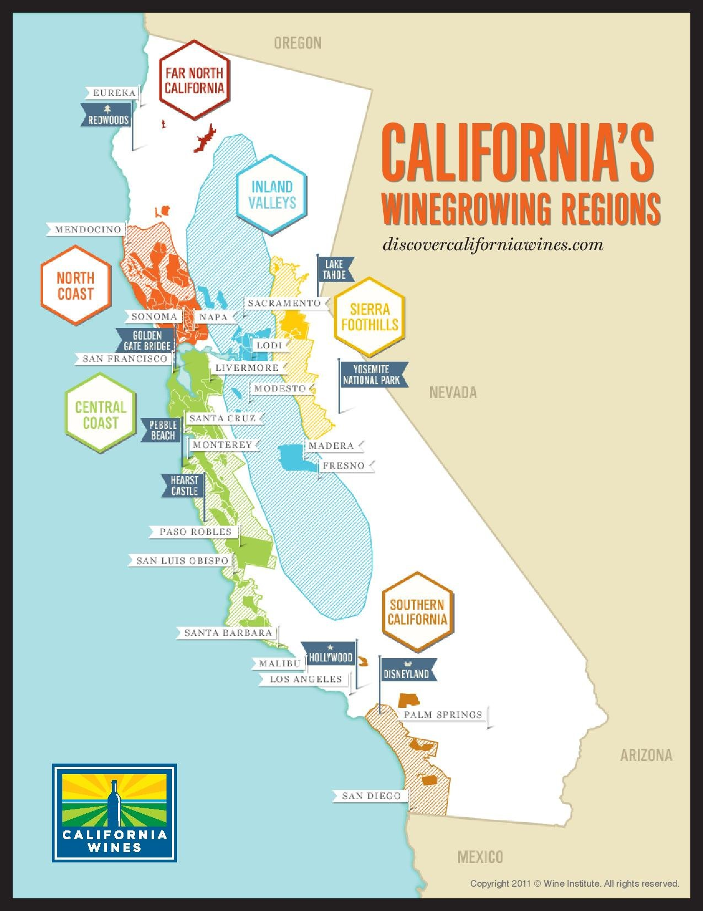
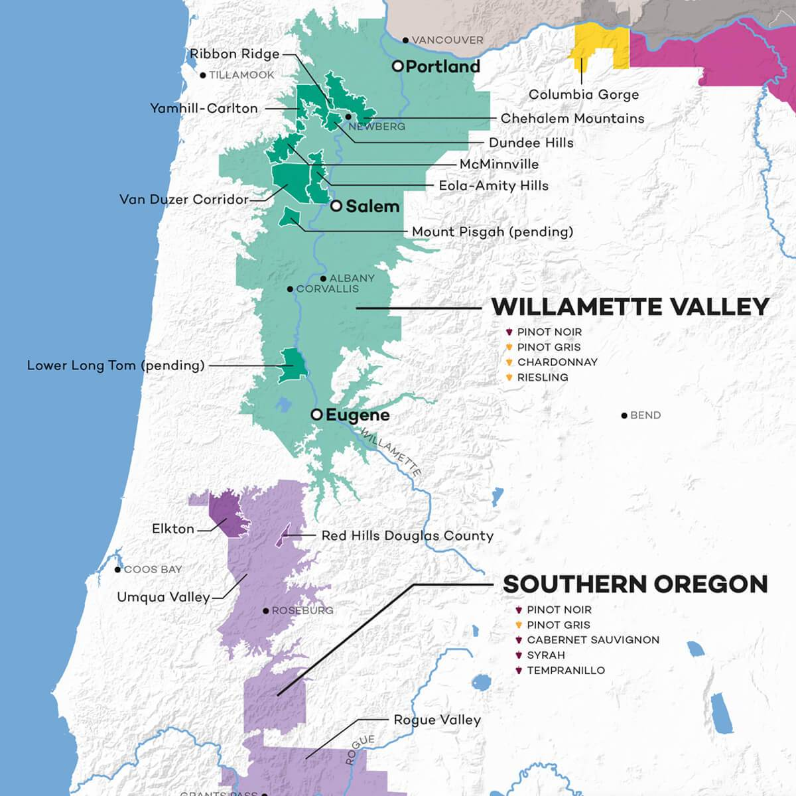

# United States and Canada

## 01 Intro

### 01 Climatic Influences

### 02 AVA Principles

- American Viticultural Areas (AVAs)
- legally defined winegrowing districts with typicity (GI)
- enforced by US Government
- Tax and Trade bureau (TBB) administers AVA's
- based on distinctive variables:
  - geographical
  - physical
  - climatic
- require that 85% of the fruit originates from the stated AVA
- no style requirements
- single-vineyard requires 95% of the fruit to come from the stated aVA
- GI:
  - AVA: 85%
  - state/country:
    - 75%
    - California and oregon require all fruit to be from that state
    - Washington requires 95% to be from that state
- vintage:
  - AVA: 95% from that vintage
  - State/County: 85%
- variety:
  - AVA: 75%
  - State/County: 75%
  - Vitus Lambrusca: 51%
- Alcohol:
  - must be labelled, +- 1.5%
  - wines between 7 - 14% can be simply labelled as table wine or light wine.
- must include term "contains sulfites" on the label
- must include a government health warning.
- estate bottled:
  - must declare name and address of the bottler
  - 100% of the fruit must come from land owned or controlled by the winery
  - all fruit must be from same AVA

Sources:

- https://www.guildsomm.com/learn/study/w/study-wiki/208/north-america#01

### 03 Principal Wine Districts of California and Varietals Associated with These Areas

  
Map of Wine in California

- Napa:
  - red:
    - Cabernet Sauvignon
    - Merlot
    - Pinot Noir
    - Zinfandel
    - Cabernet Franc
  - climate:
    - Mediterranean
    - large diurnal shift
    - fog from san pablo bay
  - white grapes:
    - Chardonnay
    - Sauvignon Blanc
- Sonoma County:
  - red:
    - Pinot Noir
    - Cabernet Sauvignon
    - Zinfandel
    - Merlot
    - Syrah
  - White:
    - Chardonnay
    - Sauvignon Blanc
- San Francisco Bay Area:
  - ?
- Monterey County:
  - White:
    - Chadonnay
    - Riesling
    - Pinot Blanc
  - Red:
    - Pinot Noir
    - Cabernet Sauvignon
    - Merlot
    - Zinfendel
- Santa Barbara:
  - red:
    - Pinot Noir
    - Syrah
  - white:
    - Chardonnay
    - Sauvignon Blanc
- Paso Robles:
  - red:
    - Zinfandel
    - Cabernet Sauvignon
    - Syrah
  - white:
    - Viognier
    - Roussanne

Sources:

- [Napa](https://www.guildsomm.com/research/compendium/w/united_states/2280/napa-valley-ava)
- [Sonoma County](https://www.guildsomm.com/research/compendium/w/united_states/2501/sonoma-county)
- [Paso Robles](https://en.wikipedia.org/wiki/Paso_Robles_AVA#Wine_Industry)
- [Monterey](https://en.wikipedia.org/wiki/Monterey_County_wine#Unique_Grapes)

### 04 Principal Wine Districts of Oregon and Varietals Produced

Map of Oregon Wine Regions

- Willamette Valley AVA:
  - white:
    - Pinot Gris
    - Chardonnay
    - Riesling
    - Pinot Blanc
  - red:
    - Pinot Noir
    - Syrah
- Colombia Valley (Columbia Gorge AVA):
  - white:
    - Chardonnay
    - Pinot Gris
    - Riesling
  - red:
    - Pinot Noir
- Walla Walla (Walla Walla Valley AVA):
  - split between Washing ton and Oregon
  - reds:
    - Syrah
    - Cabernet
    - Merlot

Sources:

- [Willamette Valley](https://www.guildsomm.com/research/compendium/w/united_states/2521/willamette-valley-ava)
- [Colombia Valley](https://www.guildsomm.com/research/compendium/w/united_states/2583/columbia-gorge-ava-oregon)
- [Walla Walla]()

### 05 Principal Wine Districts of Washington

- Colombia Valley
- Walla Walla
- Puget Sound
- Yakima Valley

### 06 Climate Related to Topography

## 02 Certified

### 01 Associated AVA's

- Sonoma
- Napa
- Monterey
- Santa Barbara

### 02 Principal Wine Districts of Washingon / Oregon
